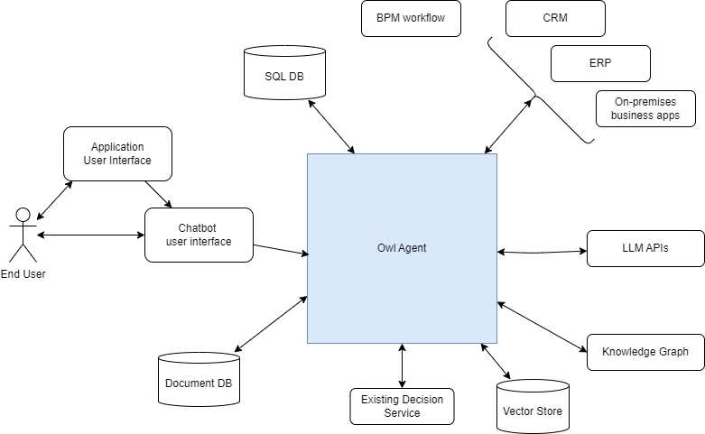
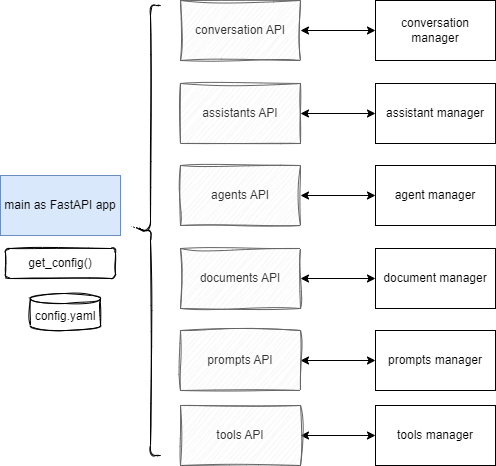
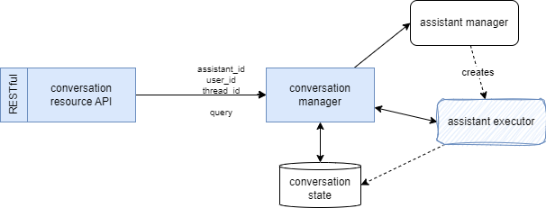
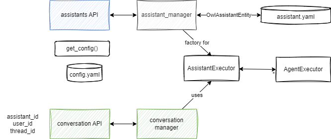
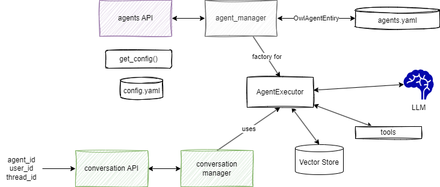

# Architecture

## High Level requirement for Owl Framework

* [ ] Ability to access information from corporate IT systems (typically databases or systems that host key corporate data such as CRM, Maximo, or ERP systems)
* [ ] Ability to leverage information found in corporate documents that help formulate responses or policy, on top of the formalized decisions made by decision services
* [ ] Ability to access decision services by providing needed input parameters from a combination of chatbot context and enterprise IS data, and by injecting the decision service output back to the LLM’s conversation context for output text generation. 
* [ ] Ability to host the chatbot in multiple environments, including public cloud, private cloud, or enterprise data center.
* [ ] Easily creating tool calls for decision services in multiple BRMS.

## System context

It is important to address the system context to define the OwlAgent's boundaries and its interactions with external entities (users, other systems, and any external interfaces). This diagram helps developers, architects gain a shared understanding of the project's scope and boundaries. It allows everyone involved to visualize the system's external entities and identify the various interactions that need to be supported.



The system context diagram aids in identifying the interfaces with external systems and services when the system is deployed.

In this diagram we have the following external actors:

1. End User interacting with the platform to get support to make decision using unstructured information in natural language. Classical user is a support team member try to get help, to better manage a customer reclamation, and get the next best action.
1. ChatBot user interface: web application, at first deployed for internal staff, but with the capability to access on-premises backend and public APIs.
1. LLMs API: most large language models will be accessed via public endpoint and API keys, but it supports on-premises LLM API with or without API key.
1. Any business solution application needs to integrate with data-sources, and the goal is to expose those endpoint as tool calling capability so LLM can decide to make a call to those service. Those end points are REST and json based but could be SOAP web services too. Those business services include CRM, ERP, on-premises business applications, BPM workflow...
1. Structured data in SQL database may be directly used, and SQL queries may be integrated as function to be callable by tool calling.
1. Unstructured data, in the form of key-value pair are persisted in Document Database and accessible also via tool calling
1. A OwlAgent is about integrating with rule based system, there will be a domain specific next-best action ruleset per deployed solution but the system integrates with existing decision services.
1. A vector store to keep embedding of domain specific documentation and knowledge


## Component View

To zoom into the OwlAssistant server, we can highlight the following components, outside of any technology choice:

{ width=800 }

1. The end-user interacts with a single page application (SPA) within a Web Browser. Admin user uses SPA app with more panels. 
1. This SPA is served by a **backend for front end** or BFF, that can be deployed in different regions, worldwide or on-premises.
1. OwlAgent exposes **REST APIs** to serve the SPA, with different routes for each different microservices.
1. **End-user** management component, manages user group and user type to help controlling access to administration panels versus end user's ones. It is a dedicated deployment unit. A microservice.
1. **Assistant manager** component is responsible to define assistant, which map to a use case specific to a business application or a business process where human needs assistant. Assistant defines agents and tasks. This component persists metadata about the assistant. It is also a microservice, with CRUD operation on Assistant. The code to support the integration of the assistant is a dedicated class in the controller. Instantiation of this class is done via inversion of control and configuration. 
1. **Agent manager** component is responsible to define agent. It persists metadata about the agent. Agent is a prompt, a set of tools, tool mapping, a vector store reference or collection within a vector store, a LLM API reference, a LLM model reference. It is also a microservice, with CRUD operation on Agent. The code to support the integration of the agent is a dedicated class in the controller. Instantiation of this class is done via inversion of control and configuration. 
1. **Prompt manager**, manage the different prompts with its metadata. Prompt instances are linked to the agent and use case to implement. THey may be localized. 
1. **Locale manager** manages localization for English, French, Spanish for user interface elements
1. **Conversation Manager**, this component will have a base implementation to serve Q&A interaction and Chat based conversation. It may be unique per deployed solution as it defines tool and specific configuration.
1. **Tool manager** manage tool definition and code reference to instantiate during orchestrator creation
1. **Document management** is responsible to expose document upload management, storage to cloud storage, meta data management, and trigger embeddings. The document processing may be adapted to each deployment of the solution. This component should map the documents to domain vector store mapping.
1. **Vector Store manager**, to get better RAG, we need to have dedicated, domain specific, vector store or collection within a vector store, so this component is responsible of the management of the metadata of the vector stores.
1. **Decision Service Connector**: is a component that will do data mapping for the existing decision service to be integrated as tool in the Agent Graph. 
1. **LLM connector** is an integration layer to the different LLMs. It could include existing LangChain constructs, or special API one, or locally deployed LLM. LLM connectors to support are WatsonX.ai, OpenAI, Anthropic, Mixtral, Llama3, and any open source models remotely accessible. 

The platform supports services to address governance end-to-end, with security access control, logging and auditing. Conversation flows will be persisted for playbacks and lineage. Governance is a day one design decision for this platform.

## Component design

The core server needs to support:

* [x] The runtime as a web server serving OpenAPI REST apis. --> FastAPI is used with the main function using middleware and routers [athena.main](https://github.com/AthenaDecisionSystems/athena-owl-core/blob/main/owl-agent-backend/src/athena/main.py). 
* [x] Docker image packaging for easy deployment on any platform. --> [Dockerfile](https://github.com/AthenaDecisionSystems/athena-owl-core/blob/main/owl-agent-backend/src/Dockerfile) and how to use it in the context of a demonstration is illustrated in the [Docker-compose file](https://github.com/AthenaDecisionSystems/athena-owl-demos/blob/main/IBU-insurance-demo/deployment/local/docker-compose.yaml)

```yaml
owl-backend:
    hostname: owl-backend
    image: athena/owl-backend
    container_name: owl-backend
    ports:
    - 8000:8000
    environment:
    CONFIG_FILE: /app/config/config.yaml
    OPENAI_API_KEY: $OPENAI_API_KEY
    volumes:
    - ../../ibu_backend/config:/app/config
    - ../../.env:/app/.env
    - ./data/file_content:/app/file_content
    - ./data/chromadb:/app/chromadb
    - ../../ibu_backend/src/ibu:/app/ibu
```

    Configuration and code is mounted inside the docker container. The configuration defines the classes to instantiate in the different components that are linked to the specific assistant.

* [x] Default server configurations for a specific assistant are defined in an external [config.yaml](https://github.com/AthenaDecisionSystems/athena-owl-demos/blob/main/IBU-insurance-demo/ibu_backend/config/config.yaml)
* [x] Server can have different assistants running in parallel in the context of user conversation. So a conversation is the glue to the assistant.
* [ ] Server supports multiple end user conversations.


#### Approach

When the process starts, it loads the server configuration and keeps the configuration as a singleton. The server offers a set of health APIs and conversation APIs.




Each router api defines the VERB and resource path and then delegates to another service implementation. Those services are singletons.

### Conversation orchestration

The conversation is what links the assistant to a user. The user starts a conversation using a chatbot graphycal user interface. The context of the conversation should include the assistant_id, the user_id, and a thread_id to keep track of the conversation. As chat has history the chat_history is also kept. 

#### Requirements

* [x] The conversation supports synchronous chat API
* [ ] The conversation supports asynchronous/ streaming chat API
* [x] Need to identify a unique user to keep conversation states, and history
* [ ] Conversation states are persisted in remote database
* [x] Conversation uses the assistant_id to get an instance of the assistant executor, to pass the conversation context.

#### Approach

The conversation REST resource expose synchronous or async API and delegate to a conversation manager. 



The conversation parameter includes the user_id, so the server manages multiple users in parallel, the assistant_id as a conversation is linked to a use case so an assistant. To get the assistant executor the assistant manager creates one instance according to the AssistantEntity definition.

Th assistant instance exposes `invoke` or `stream` methods to send query to LLM and stream or not the response.

### Assistant Manager

A specific use case implementation is supported by one Assistant. It is not exactly the same concept as the OpenAI assistant, but it may look more as a Crew of agents like in Crew.ai. Assistant defines one or more agents, and if orchestration is needed a dedicated class needs to be implemented.

Assistant will be LangGraph graph when it needs to be stateful, oe LangChain chain when stateless. LangGraph brings the persistence of the conversation with the thread_id and the ability to playback the conversation, therefore it will be the first implementation choice. 

In the case of IBU insurance demo , we have one Assistant, one agent, one prompt, and 3 or 4 tools. The implementation of the assistant is a graph with two nodes: one LLM and one tool_calling node.

There are a set of pre-defined assistants. See the [config file for assistants](https://github.com/AthenaDecisionSystems/athena-owl-core/blob/main/owl-agent-backend/src/athena/config/assistants.yaml).

| Assistant Name | Goal |
| --- | --- |
| Base Assistant | The base assistant uses LangGraph with one node to implement a simple assistant with a unique node which is an OpenAI agent |
| Base Tool Assistant | Use a agent and a tool node to search with Tavily tool |


#### Requirements

* [x] Assistant can be defined by configuration, but also via CRUD APIs as REST resources. Assistant is defined by a unique id, a name, description, some metadata, a class to support the implementation and the list of agents.
* [ ] Assistant defines a set of agents, and tools an agent can use. Agent is linked to a LLM model. So assistant can be a group of agent using different LLMs. 
* [x] Agent can be a LangGraph graph class with a contract to support invoke and stream. The class is instantiated at runtime from configuration.
* [x] Support loading configuration for at least one assistants and cached in memory. 


#### Approach

The assistant configuration includes a yaml definition such as:

```yaml
base_tool_assistant:
  assistant_id: base_tool_assistant
  class_name: athena.llm.assistants.BaseToolAssistant.BaseToolAssistant
  description: A default assistant use LLM and tool to do web search
  name: Default tool assistant
  agent_id: anthropic_claude_3
```



The assistant REST resource defines the FastAPI router (see code `routers/assistants.py`) and the CRUD verbs. The code delegates to a repository. The entity is `OwlAssistantEntity` which maps the definition of the yaml above.

```python
   
router = APIRouter( prefix= get_config().api_route +"/a")

@router.get( "/assistants/")
def get_all_assistants() -> List[OwlAssistantEntity]:
   all = get_assistant_manager().get_assistants()
   ...
```

The manager also includes a factory method to create an instance of the AssistantExecutor so a conversation can create this instance and process the query of the conversation.

!!!- info "Not yet covered"

### Agent Manager

#### Requirements

* [x] Defines some agents via config file in yaml format, loaded and cached in the agent manager
* [ ] Agent references the prompt to use and the model parameters like model name, temperature, top K, top P...


#### Approach




### Document manager

#### Requirements

* [ ] Support uploading txt, markdown, pdf, .docx, html file. The file may be in a remote repository accessible using URL and so does not need to be move in another location.
* [x] Support keeping metadata about the file like type, ownership, catagories, tags
* [ ] Support file description dedicated repository layer, injectable, and configurable
* [ ] Support splitting the document into smaller chunks. 
* [ ] Support chunk embeddings and persistence into vector database (Support Chromadb)
* [ ] Support similarity search in indexes
* [ ] (optional) support persisting to a cloud object storage like S3. The bucket is own by Athena, but prefix is dependent of the solution
* [ ] Standalone deployment of this component as container deployable on any cloud or on-premises environment
* [ ] Embeddings will depend of the LLM selected so need to support external configuration and IoC component

#### Approach

Expose a REST resource for document management with core processing dependent od configuration:


* File descriptor specifies some meta-data about the file uploaded. The file can be uploaded using the REST operation or given a URL to get the document from this URL.
* Configuration defines:

- name of the embeddings to use
- vector store used and path or URL when using remote access
- 

### Prompt manager

#### Requirements

* [x] Support prompt manager as a component, as a singleton, with prompts coming from one file
* [x] Cache the prompts in memory for demonstration purpose
* [x] Support adding new prompt with a unique key. If key exists then it is an update
* [x] Support get by key for a prompt
* [x] Support deleting a prompt given its key

#### Approach

For the open source version the persistence is file system. DEfault key name and file path to persist the prompts are in config file. the `prompts.json` is created manually for default prompt.

### Relationship between components

An Agent is a prompt, a LLM backend, model reference, and tool references.

```yaml
    ibu_insurance_agent:
        agent_type: openai
        model_ref:  gpt-3.5-turbo-0125
        ow_agent_class: athena.llm.agent_openai.OpenAIClient
        prompts:
            
```


## Physical Deployment


