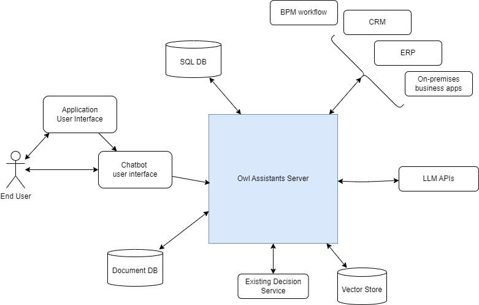
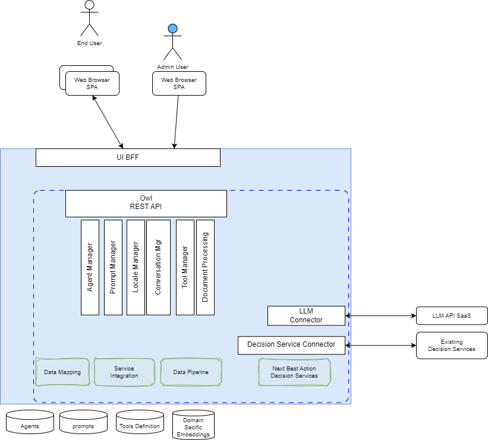
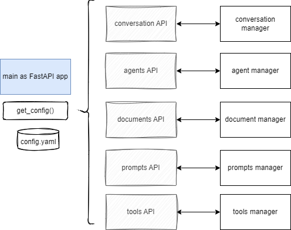
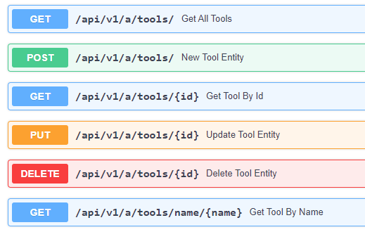

# Architecture

## Versions

* Created March 2024 - Updated 7/18/2024

## High Level requirement for OwlAgent Framework

* [ ] Ability to access information from corporate IT systems (typically databases or systems that host key corporate data such as CRM, Maximo, or ERP systems).
* [ ] Ability to leverage information found in corporate documents that help formulate responses or policy, on top of the formalized decisions made by decision services.
* [x] Ability to access decision services by providing needed input parameters from a combination of chatbot context and enterprise IT data, and by injecting the decision service output back to the LLM’s conversation context for output text generation.
* [ ] Ability to host the chatbot in multiple environments, including public cloud, private cloud, or enterprise data center.
* [ ] Easily create tools for decision services in multiple BRMS.

## System Context

It is important to address the system context to define the OwlAgent's boundaries and its interactions with external entities (users, other systems, and any external interfaces). This diagram helps developers and architects gain a shared understanding of the project's scope and boundaries. It allows everyone involved to visualize the system's external entities and identify the various interactions that need to be supported.



The system context diagram aids in identifying the interfaces with external systems and services when the system is deployed.

In this diagram we have the following external actors:

1. End User interacting with the platform to get support to make decision using unstructured information in natural language. Classical user is a support team member try to get help, to better manage a customer reclamation, and get the next best action.
1. ChatBot user interface: web application, at first deployed for internal staff, but with the capability to access on-premises backend and public APIs.
1. LLMs API: most large language models will be accessed via public endpoint and API keys, but it supports on-premises LLM API with or without API key.
1. Any business solution application needs to integrate with data-sources, and the goal is to expose those endpoint as tool calling capability so LLM can decide to make a call to those service. Those end points are REST and json based but could be SOAP web services too. Those business services include CRM, ERP, on-premises business applications, BPM workflow, etc.
1. Structured data in SQL database may be directly used, and SQL queries may be integrated as function to be callable by tool calling.
1. Unstructured data, in the form of key-value pair are persisted in Document Database and accessible via tool calling.
1. An assistant integrates with rule based systems - typically there will be a domain specific next-best action ruleset per deployed solution but the system integrates with existing decision services.
1. A vector store to keep embeddings of domain-specific documentation and knowledge.

## Component View

To zoom into the OwlAgent Framework backend server, we can highlight the following components, outside of any technology choices:

{ width=800 }

1. And end user interacts with a single page application (SPA) within a Web Browser. An admin user uses an SPA app with more panels.
1. This SPA is served by a **backend for front end** or BFF, that can be deployed in different regions, worldwide or on-premises.
1. OwlAgent exposes **REST APIs** to serve the SPA, with a different route for each different microservice.
1. **End-user** management component, manages user group and user type to help controlling access to administration panels versus end user ones. It is a dedicated deployment unit. A microservice.
1. **Assistant manager** component creates and manages assistants, which map to a use case specific to a business application or a business process that assists humans making decisions or taking actions. An assistant defines agents. This component persists metadata about the assistant. It is also a microservice, with CRUD operations on Assistant. The code to support the integration of the assistant is a dedicated class in the controller. Instantiation of this class is done via inversion of control and configuration.
1. **Agent manager** component creates and manages agents. It persists metadata about the agent. An agent includes a prompt, a set of tools, tool mapping to Python functions, a vector store reference or collection within a vector store, a LLM API reference, and a LLM model reference. It is also a microservice, with CRUD operation on Agent. The code to support the integration of the agent is a dedicated class in the controller. Instantiation of this class is done via inversion of control and configuration.
1. **Prompt manager**, manage the different prompts with its metadata. Prompt instances are linked to the agent and use case to implement. THey may be localized.
1. **Locale manager** manages localization for English, French, Spanish and potentially other languages for user interface text.
1. **Conversation Manager** manages conversations between the end user and the back-end server (mediated via a front-end server).  This component has a base implementation to serve Q&A interaction and chat based conversation. It may be unique per deployed solution as it defines tool and assistant-specific configuration.
1. **Tool manager** manages tool definitions and code references that are instantiated during agent creation and use.
1. **Document management** exposes document upload management, cloud storage access, metadata management, and trigger embeddings.  Document processing can be adapted for each solution deployment. This component should map the documents to domain vector store mapping.
1. **Vector Store manager**: For good RAG, we need to have dedicated, domain specific vector stores or collections within a vector store. This component is responsible for the management of the metadata of the vector stores.
1. **Decision Service Connector**: is a component that will do data mapping so that an existing decision service to be integrated as a tool in an agent.
1. **LLM connector** is an integration layer to the different LLMs. It can include existing LangChain constructs, or special API one, or locally deployed LLM. LLM connectors to support are WatsonX.ai, OpenAI, Anthropic, Mixtral, Llama3, and any open source models remotely accessible.

The platform supports services to address governance end-to-end, with security access control, logging and auditing. Conversation flows will be persisted for playbacks and lineage. Governance is a day one design decision for this platform.

## Component design

The core server needs to support:

* [x] The runtime as a web server serving OpenAPI REST apis. --> FastAPI is used with the main function using middleware and routers [athena.main](https://github.com/AthenaDecisionSystems/athena-owl-core/blob/main/owl-agent-backend/src/athena/main.py).
* [x] Docker image packaging for easy deployment on any platform. --> [Dockerfile](https://github.com/AthenaDecisionSystems/athena-owl-core/blob/main/owl-agent-backend/src/Dockerfile) and how to use it in the context of a demonstration is illustrated in the [Docker-compose file](https://github.com/AthenaDecisionSystems/athena-owl-demos/blob/main/IBU-insurance-demo/deployment/local/docker-compose.yaml)

```yaml
owl-backend:
    hostname: owl-backend
    image: athena/owl-backend
    container_name: owl-backend
    ports:
    - 8000:8000
    environment:
    CONFIG_FILE: /app/config/config.yaml
    OPENAI_API_KEY: $OPENAI_API_KEY
    volumes:
    - ../../ibu_backend/config:/app/config
    - ../../.env:/app/.env
    - ./data/file_content:/app/file_content
    - ./data/chromadb:/app/chromadb
    - ../../ibu_backend/src/ibu:/app/ibu
```

Configuration and tool code is mounted inside the docker container. The configuration defines the classes to instantiate in the different components that are linked to a specific assistant.

* [x] Default server configurations for a specific assistant are defined in an external [config.yaml](https://github.com/AthenaDecisionSystems/athena-owl-demos/blob/main/IBU-insurance-demo/ibu_backend/config/config.yaml)
* [x] A server can have different assistants running in parallel in the context of user conversations. So a conversation is the glue to the assistant.
* [ ] Server supports multiple end user conversations.

### Architecture Approach

When the backend server process starts, it loads the server configuration and keeps the configuration as a singleton. The server offers a set of health APIs and conversation APIs.



Each router api defines the HTTP verb and resource path and then delegates to another service implementation. Those services are singletons.

### Conversation orchestration

The conversation is what links the assistant to a user. The user starts a conversation using a chatbot graphical user interface (aka a front-end server). The context of the conversation should include the `assistant_id`, the `user_id`, and a `thread_id` to keep track of the conversation. As a conversation has history the `chat_history` is also kept.

#### Requirements

* [x] The conversation supports synchronous chat API
* [ ] The conversation supports asynchronous/ streaming chat API
* [x] Need to identify a unique user to keep conversation states, and history
* [ ] Conversation states are persisted in remote database
* [x] Conversation uses the assistant_id to get an instance of the assistant executor, to pass the conversation context.

#### Approach

The conversation REST resource expose synchronous or async API and delegates to a conversation manager.


The conversation parameter includes the `user_id`, so the server manages multiple users in parallel, the `assistant_id` as a conversation is linked to a use case thus to an assistant. To get the assistant executor the assistant manager creates one instance according to the `AssistantEntity` definition.


The assistant instance exposes `invoke` or `stream` methods to send queries to the underlying LLM and provide the response back either as a single block or asynchronously via streaming.

### Assistant Manager

A specific business use case implementation is supported by one Assistant. It is not exactly the same concept as the [OpenAI assistant](https://platform.openai.com/docs/assistants/overview) which is rather monolithic; rather, it is closer to a crew of agents like in [Crew.ai](https://docs.crewai.com/). An assistant uses one or more agents, and if orchestration is needed between the agents, a dedicated class needs to be implemented.

An assistant uses a LangGraph graph when it needs to be stateful, or a LangChain chain when stateless. LangGraph brings the persistence of the conversation with the `thread_id` and the ability to play back the conversation, therefore it will be the preferred implementation choice.

#### Assistant Requirements

* [x] Assistant can be defined by configuration, but also via CRUD APIs as REST resources. An assistant is defined by a unique id, a name, a description, some metadata, a class to support the implementation, and a list of agents.
* [x] Assistant defines a set of agents, and tools an agent can use. Agent is linked to a LLM model. So an assistant can be a group of agents using different LLMs.
* [x] Agent can be a LangGraph graph class with a contract to support invoke and stream. The class is instantiated at runtime from configuration.
* [x] Support loading configuration for at least one assistants and cached in memory.

[>>> See detail design section](design.md/#assistants)

### Agent Manager

An agent groups an LLM reference, a system prompt, and tool declarations. The agent manager manages this metadata in the OwlAgentEntity object. The application uses an agent executor instance.

#### Agent Requirements

* [x] Define agents via a config file in yaml format, loaded and cached in the agent manager.
* [x] Agent manager manages CRUD operations of the AgentEntity.
* [x] AgentEntity references the prompt to use and the model parameters like model name, temperature, top K, top P, etc.

[>>> See detail design section](design.md/#agents)

### Document Manager

#### Document Manager Requirements

* [ ] Support uploading different file formats including txt, markdown, PDF, MS Word, HTML, and others. The file may be in a remote repository accessible using a URL and so does not need to be moved to another location.
* [x] Support keeping metadata about the file like type, ownership, catagories, tags.
* [ ] Support a file description dedicated repository layer, injectable, and configurable.
* [ ] Support splitting the document into smaller chunks.
* [ ] Support chunk embeddings and persistence into vector database (Support [Chromadb](https://www.trychroma.com/)).
* [ ] Support similarity search in indexes.
* [ ] (optional) Support persisting to a cloud object storage like S3. The bucket is owned by Athena, but prefix is dependent on the solution. _[HED]: Bucket should be owned by end-user._
* [ ] Standalone deployment of this component as a Docker container deployable on any cloud or on-premises environment.
* [ ] Embeddings will depend on the LLM selected so need to support external configuration and IoC component.

#### Document Manager Approach

Expose a REST resource for document management with core processing dependent od configuration:


* The file descriptor specifies some metadata about the file uploaded. The file can be uploaded using the REST operation or given as a URL to get the document from this URL.
* Configuration defines:
  * name of the embeddings to use
  * vector store used and path or URL when using remote access

### Tool Manager



### Prompt manager

#### Prompt Manager Requirements

* [x] Support prompt manager as a component, as a singleton, with prompts coming from one file.
* [x] Cache the prompts in memory for demonstration purpose.
* [x] Support adding new prompt with a unique key. If key exists then it is an update.
* [x] Support get by key for a prompt.
* [x] Support deleting a prompt given its key.

#### Prompt Manager Approach

For the open source version the persistence is in the file system. Default key name and file path to persist the prompts are in a config file. The `prompts.json` is created manually for the default prompt.

### Relationship between components

An Agent includes a prompt, an LLM backend, a model reference, and tool references.

```yaml
    ibu_insurance_agent:
        agent_type: openai
        model_ref:  gpt-3.5-turbo-0125
        ow_agent_class: athena.llm.agent_openai.OpenAIClient
        prompts:
            
```

## Physical Deployment
