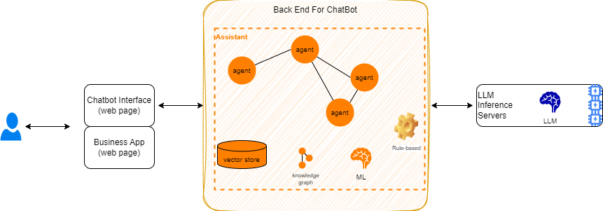
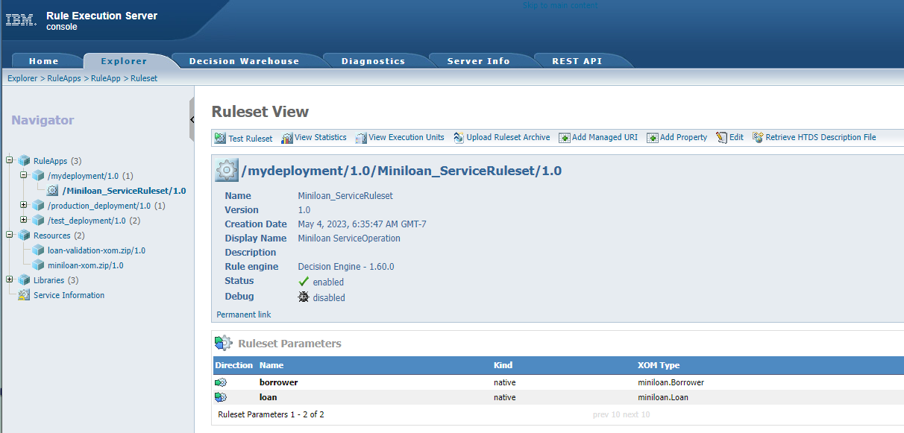
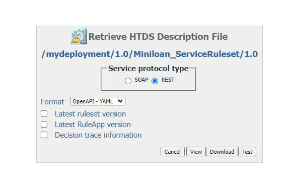
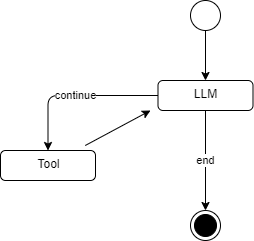

# Build solution

???+ Info "Version"
    Created 06.2024 - Updated 07/10/24

Creating a new solution using the owl framework should be straightforward at it uses yaml manifests at its core, but potential complexity may depend on the level of the requirements to integrate with external services. 

To get started consider the scope of the demonstration and assess if you need to:

- Use a specific LLM backend
- Have an existing decision service available to be used or if you need to develop a new one. A new decision service means new rules and a new data model for the rule processing. Rule discovery and analysis may take some time as the approach is to model knowledge from workers with rules and data model.
- The design of the tool calling may become more complex when the number of tool grow, and when some potential user's query may not be easy to map to tool.

Recall that an Hybrid-AI solution includes as set of components working together to deliver more reliable results, higher accuracy with stateful persistence:

{ width=800 }

We recommend reading the [design document](https://athenadecisionsystems.github.io/athena-owl-core/design/), the [architecture presentation](https://athenadecisionsystems.github.io/athena-owl-core/arch/) and some [tutorials](https://athenadecisionsystems.github.io/athena-owl-core/tutorials/new_mistral_agent/) to create agent.

## Jump start your own solution

As a first tutorial, we will use an existing decision service deployed to the IBM ODM decision server.

### Git repositories

We encourage you, to fork the OWL core repository [https://github.com/AthenaDecisionSystems/athena-owl-core](https://github.com/AthenaDecisionSystems/athena-owl-core)


And the demonstration repository: [https://github.com/AthenaDecisionSystems/athena-owl-demos](https://github.com/AthenaDecisionSystems/athena-owl-demos)

### Pre-requisites

The following tools and environments are needed:

* Python 3.11 or 3.12, using a virtual environment
* Get a the API keys for the different LLM you want to use in your solution: WatsonX.AI , OpenAI Anthropic, Mistral, ... and use the `/demo_tmpl/.env_tmpl` file to persist those API KEYS, rename the file as `.env` and move it into the demonstration folder you want to use or the new folder for your solution.

```sh
cp ../demo_tmpl/.env_tmpl .env
```


### Create project

The following steps will soon be automatized with scripts and tools, but as of now, they are manual (sorry):

* Create a folder for your project: `IBM-MiniLoan-demo` in the athena-owl-demos folder. 
* Copy the project template to the new folder:

```sh
cp -r demo_tmpl/ My-MiniLoan-demo
cd My-MiniLoan-demo
```

* Create and Start a Python virtual environment

```sh
python -m venv .venv
# For windows PC
source .venv/Scripts/activate
# For unix based PC
source .venv/bin/activate
```

  *The creation is needed only for the first time.*

* Install the Python modules needed for the solution

```sh
pip -r ibu-backend/src/requirements.txt
```

### Build the object model for decision service

The decision service exposes an REST API with an Open API document. From this document it is easy to get the data model and create Python Pydantic objects from it. Here are the steps:

1. Access the ODM Developer Edition console at [http://localhost:9060/](http://localhost:9060/), select he decision server console
1. Navigate to the RuleApp > Ruleset in the `Explorer` tab that you want to call:

    

1. Get the OpenAI yaml document and download it to a project folder `ibu_backend/src/openapi`.
    
    

1. Run the command to build the pydantic model

```sh
datamodel-codegen  --input MydeploymentMiniloan_ServiceRulesetDecisionService.yaml --input-file-type openapi --output ../ibu/itg/ds/pydantic_generated_model.py
```

Below is an extract of the generated code, and an [link to the code](https://github.com/AthenaDecisionSystems/athena-owl-demos/blob/main/IBM-MiniLoan-demo/ibu_backend/src/ibu/itg/ds/pydantic_generated_model.py).

```python
class Borrower(BaseModel):
    name: Optional[str] = None
    creditScore: Optional[int] = None
    yearlyIncome: Optional[int] = None


class Loan(BaseModel):
    amount: Optional[int] = None
    duration: Optional[int] = None
    yearlyInterestRate: Optional[float] = None
    yearlyRepayment: Optional[int] = None
    approved: Optional[bool] = True
    messages: Optional[List[str]] = []
```

*If needed review the input and optional fields as some empty attribute may generate null pointer exception in the rules* For example approved need to be initialized to True and messages to be an empty array instead of None:

```python
    yearlyRepayment: Optional[int] = None
    approved: Optional[bool] = True
    messages: Optional[List[str]] = []
```

Those steps need to be done each time there are changes to the ODM eXecutable Object Model. If this model is stable, those steps are done only one time.

### Build the python function to call ODM

???+ info "LLM and Tool calling"
    OpenAI has started the initiative of function calling and now most of the major proprietary or open source LLM model supports tool calling. *In the LLM tool calling mechanism the prompt is enhanced with information about the function signature. For example the LLM will see the following signature and will prepare the argument from the user's query*
    ```python
    def get_client_by_name(first_name: str, last_name: str)
    ```

    Here is an example of LLM trace showing the preparation of the data:
    ```
    Invoking: `get_client_by_name` with `{'first_name': 'Robert', 'last_name': 'Smith'}`
    ```

In the code template `src/ibu/llm/tools/client_tools.py` define a new function to expose a set of parameters the LLM will be able to extract from unstructured query text:

```python
def assess_loan_app_with_decision(loan_amount: int, duration: int,   first_name: str, last_name: str):
    loanRequest= Loan(duration=duration, amount=loan_amount)
    borrower =  build_or_get_loan_client_repo().get_client_by_name(first_name=first_name, last_name=last_name)
    ds_request = Request(__DecisionID__= str(uuid.uuid4),borrower=borrower, loan=loanRequest)
    payload: str = ds_request.model_dump_json()
    return callRuleExecutionServer(payload)
```

The code needs to prepare the data to call IBM ODM, using the Pydantic objects created above. 

### Define Tools

The classical common integration is when the solution needs to get data from an existing database or better a microservice managing a specific business entity. In this case the solution leverage a python function that can remote call the microservice URL using library like `requests`.

For short demonstration you may need to implement some mockup repository that could be integrated into the demo run time. The template folder includes such in memory repository. You need to update with your own data (See this file [loanapp_borrower_repo_mock.py](https://github.com/AthenaDecisionSystems/athena-owl-demos/blob/main/IBM-MiniLoan-demo/ibu_backend/src/ibu/itg/ds/loanapp_borrower_repo_mock.py)).

```python
def initialize_client_db(self):
        self.add_client(Borrower(name = "robert dupont",
                            yearlyIncome = 50000,
                            creditScore = 180
                            ))
    # ...
```

#### Adding a function as tool

As some Owl assistants are using LangGraph for agent orchestration, we will use LangChain tools API to define function calling.

There are [three ways](https://python.langchain.com/v0.1/docs/modules/tools/custom_tools/) to do so with LangChain: function annotation, using a factory function or class sub-classing. 

The tool annotation is the simplest approach. The following declaration uses annotation, and the argument names, type and comment description are very important as they will be injected as context in the prompt to the LLM. Be sure to be short but brings semantic so the LLM can decide which function to call and what parameters to extract such as the first and last names.

```python
@tool
def get_client_by_name(first_name: str, last_name: str) -> str | None:
    """get borrower client information given his or her name"""
    return build_or_get_loan_client_repo().get_client_by_name_json(first_name,last_name)
```

#### Declaring the tool in yaml

Update the `tools.yaml` file in the config folder:

```yaml
ibu_client_by_name:
  tool_id: ibu_client_by_name
  tool_class_name: 'ibu.llm.tools.client_tools'
  tool_description: 'get client information given his first and last name'
  tool_fct_name: get_client_by_name
```

???- Info "Behind the scene"
    The tool factory implementation 

### Define prompt

Prompts are defined in `prompts.json` file. 

### Define Assistant

Add the following base declaration for the main Assistant of the solution. One Assistant per use case.

```yaml
ibu_assistant:
  assistant_id: ibu_assistant
  class_name: athena.llm.assistants.BaseAssistant.BaseAssistant
  description: A default assistant that uses LLM, and local defined tools like get borrower, and next best action
  name: IBU Loan App assistant
  agent_id: ibu_agent
```

The two important properties are the `class_name` and the `agent_id`.

The [BaseAssistant class]() name is coming from Owl Agent core library. 


This is the LangGraph flow with tool and LLM. The graph looks like in the following figure:



### Define Agent


### Integration tests

### Custom user interface

You can use the OWL Front End user interface as is and can slightly customize it via environment variables which can be set in the docker-compose file:

```yaml
  owl-frontend:
    hostname: owl-frontend
    image: jbcodeforce/athena-owl-frontend:latest 
    container_name: owl-frontend
    ports:
      - 3000:80
    environment:
      - REACT_APP_OWL_AGENT_NAME="YOUR DEMO NAME"
      - REACT_APP_BACKEND_URL=http://localhost:8000/api/v1/
      - REACT_APP_ASSISTANT_ID_WITH_RULES='ibu_assistant'
      - REACT_APP_ASSISTANT_ID_WITHOUT_RULES='ibu_assistant_limited'
      - REACT_APP_DEMO_TEXT="ONE SENTENCE to use for the demo"

```

## Troubleshooting

Access to the logs of decision server or owl backend server by doing

```sh
docker logs owl-backend
docker logs decisionsvc
```

### Exception when starting ODM decision server 

The trace of the decision service may log an exception of sequence number already created. 

```sh
 org.h2.jdbc.JdbcSQLSyntaxErrorException: Sequence "SYSTEM_SEQUENCE_AAD2612D_FF17_4435_A436_6D4A63BF6D6E" already exists; SQL statement:
```

This may come from previous execution on a new database. Just deleting the `decisions/persistence` folder, and restarting the decision server solved the problem.