# IBU Insurance

???+ Info "Version"
    Created 05/2024. Updated 07/11/2024 - STILL UNDER WORK

The IBU insurance demonstration illustrates the integration with data manager service, a decision service, a vector store and a LLM as shown in the figure below:


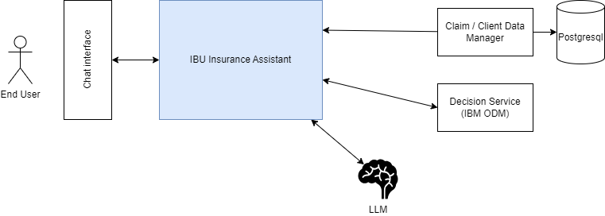{ width=900 align=center}

<div class="grid cards" markdown>

-   :material-clock-fast:{ .lg .middle } __Set up in 5 minutes__

    ---
    create a `.env` file under IBU-insurance-demo with the API key for the LLM you want to use. See the file template in `demo_tmpl/.env_tmpl`. Then
    cd IBU-insurance-demo/deployment/local && docker-compose up -d 

    and get up and running in minutes. 

    [:octicons-arrow-right-24: Demonstration Script](#demonstration-flows)

-    :material-file-code: __Develop around this demo__

    ---
    Tune the content of this demonstration or deep dive into how it is built.
    [:octicons-arrow-right-24: Work on code](#architecture)

-   :material-scale-balance:{ .lg .middle } __Open Source, Apache__

    ---

    Owl Agent and demonstration are licensed under Apache and available on [GitHub](https://github.com/AthenaDecisionSystems/athena-owl-demos/blob/main/LICENSE)

    [:octicons-arrow-right-24: License](#)
</div>

## Goals

The IBU Insurance agent chatbot helps IBU Insurance’s customer service representatives manage customer complaints about their claims handling. The chatbot is used by the customer service reps when a customer calls or writes with a complaint.

The chatbot should bring consistent responses and actionable decisions, which improves the complain management by more than 27% and improve the quality responses by 35% while reducing the cost by around 60%. 


[](https://www.youtube.com/watch?v=fGEU_obHM5M){ width=600 }

[Link to video](https://www.youtube.com/watch?v=fGEU_obHM5M)


## Insurance context

In most insurance organization we may find the following roles Involved in Complaint Handling process:

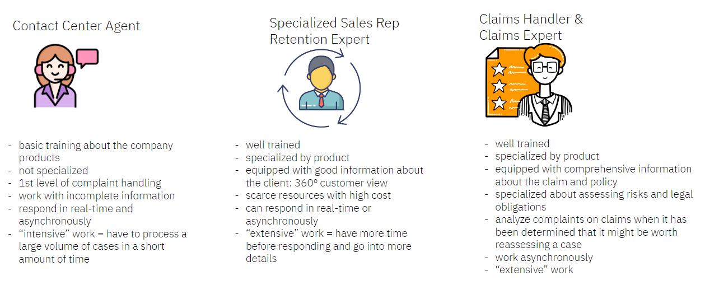

The AI assistant will help the contact center agents.

In the insurance industry the strategy to better manage customers is based on a metric called the Customer LifeTime Value or CLTV. The higher the value, the better will be the customer support, with some personalized service with dedicated advisor. At the lower range, the insurance may let their customers go away as it might actually reduce adverse selection and improve the overall profitability of the company. Finally for the bigger part of the customer profile, the company may want to retain them but using some retention effort at the minimum cost. 

As part of the automated chatbot integration the business policy may first evaluate the risk of churn and then reassign the interaction to the retention department if needed.

## Build for demonstration

For development purpose, build the DataManager microservice image:

```sh title="Under the datamgt folder"
./build/buildImage.sh
```

The docker images for the DataManager microservice, the chatbot frontend and for the OWL Backend are available on docker hub.

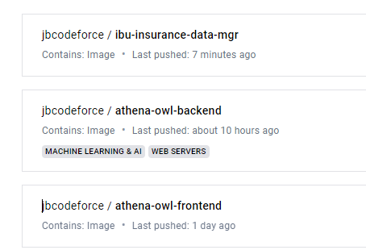

The docker compose starts by downloading docker images from Docker Hub. Those images were built on intel based architecture. If you run on arm architecture like the MAC M family, you need to build the owl backend and owl front end images ([See the instructions here](https://athenadecisionsystems.github.io/athena-owl-core/design/#pre-requisites)). 

## Run locally

* Get a the API keys for the different LLM you want to use in your solution: WatsonX.AI , OpenAI Anthropic, Mistral, ... and use the `/demo_tmpl/.env_tmpl` file to persist those API KEYS, rename the file as `.env` and move it the miniloan demonstration folder.

```sh
# under IBU-insurance-demo
cp ../demo_tmpl/.env_tmpl .env
```

To start all the components of the solution like the owl_backend, the owl_frontend, the data manager, postgresql database, and the ODM decision service, use the docker compose file locally under the `IBU-insurance-demo/deployment/local/` folder. 

* Start all the services:

```sh title="IBU-insurance-demo/deployment/local/ folder."
docker-compose up -d 
```

The first time you launch it, it may take some time as it downloads the needed docker images from docker hub.

* Verify that the six containers are running:

```sh
docker ps
```

```
2ecb23b78ad5   jbcodeforce/ibu-insurance-data-mgr:latest  0.0.0.0:8080->8080/tcp, 8443/tcp         datamgr
3988ffd617c6   jbcodeforce/athena-owl-backend:latest      0.0.0.0:8000->8000/tcp                   owl-backend
258460ed25ed   jbcodeforce/athena-owl-frontend:latest      0.0.0.0:3000->80/tcp                   owl-frontend
349f3beb4174   icr.io/cpopen/odm-k8s/odm:8.12             0.0.0.0:9060->9060/tcp, 9080/tcp, 0.0.0.0:9443->9443/tcp, 9453/tcp   decisionsvc
070e124923f7   postgres:latest                            0.0.0.0:5432->5432/tcp                   postgres
86052092cfe7   ghcr.io/chroma-core/chroma:latest          0.0.0.0:8005->8000/tcp                   chroma-db
```

* To look at the *owl-backend* logs

```sh
docker logs owl-backend
```

Next see the demonstration script section below, or the non-regression tests to validate automatically the demonstration scenario execution.


## Demonstration Flows

The business policies are declared in a semi-structured [document](https://github.com/AthenaDecisionSystems/athena-owl-demos/blob/main/IBU-insurance-demo/scenarios/IBU_policies_2.md), and were extracted using the "[Agile Business Rule Development Methodology](https://link.springer.com/book/10.1007/978-3-642-19041-4)". An extract of this document is shown in the figure below:

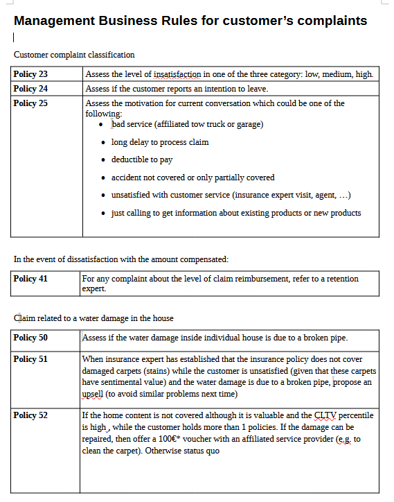

* The business policy 52 is implemented in IBM ODM as the following rule:

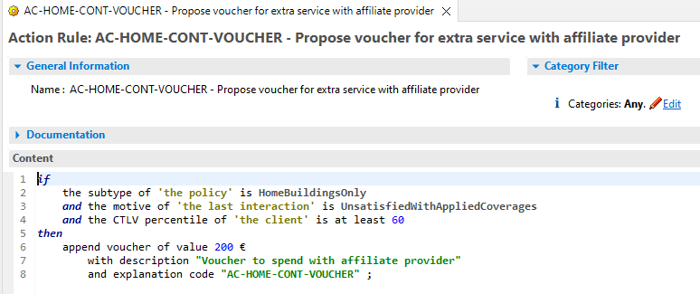{ width=900 }

Which is visible in the Decision Center at the address [http://localhost:9060/decisioncenter](http://localhost:9060/decisioncenter/login).

* Now to illustrate that using the policy document as input for a Retrieval Augmented Generation will provide limited value to customer support staff's query, you can use the OWL Frontend user's interface at [http://localhost:3000/](http://localhost:3000/):

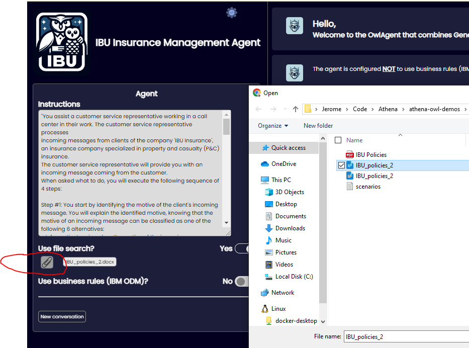

**[Optional]**: Once the document is uploaded, you can use the OWL_backend APIs to do a some similarity searches on the document content. The URL for the APIs is [http://localhost:8000/docs](http://localhost:8000/docs), while the API for similarity search is in the documents RESTful resource .

* Using the following query: "" we can see that the LLM with or without RAG does not give the real answer, and also at different time, it returns different answer

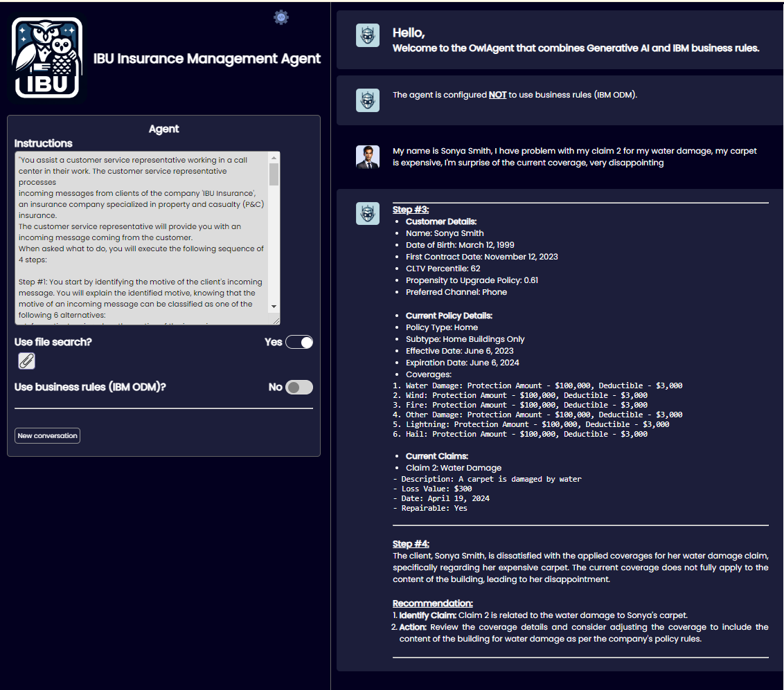

* Setting the flag to use ODM, give the result according to the rules:

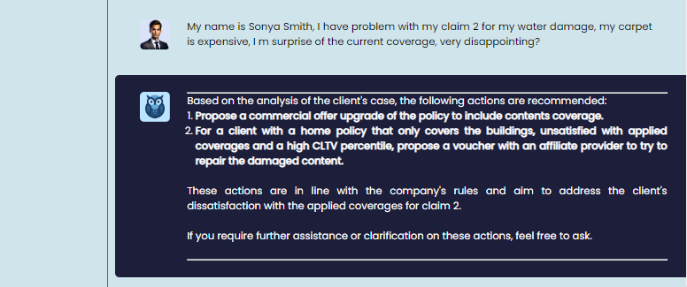

### Validate the demo with python code


Under the `e2e` folder you can find different tools to support automatic testing:

* Create python virtual environment if not created before:

```sh
python -m venv .venv
# for MAC / Linux users
source ./venv/bin/activate
# for Windows
source ./venv/Scripts/activate
```

* Install needed library to run those tests

```sh
cd e2e
pip install -r requirements.txt
```

* Run the happy path tests:

```sh
cd e2e
python non_regression_tests.py
```

### Maintenance activities for the demonstration

* It may be relevant to reset the vector store database. To do so, delete the folder with the data content. 

```sh
cd IBU-insurance-demo/deployment/local
rm -r data/chromadb
rm -r data/file_content
```

* Restarting the owl-backend. As of now as the backend does not use a database, it loads Owl Entity definitions from file manifests. So sometime it is needed to restart the server using the following commands:

```sh
cd IBU-insurance-demo/deployment/local
docker stop owl-backend
docker-compose up -d   # should restart only the owl-backend
```

## Architecture

The high level the architecture for this demonstration looks like in the following figure:

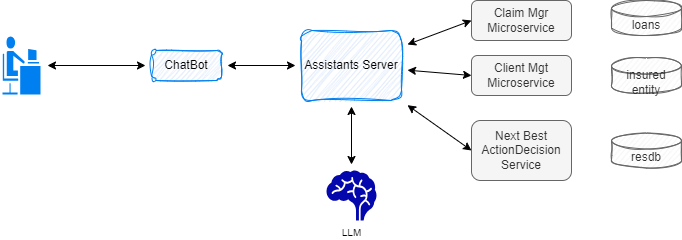{ width=800 }

* A chatbot supports the interactions in natural language queries
* The assistant server manages the conversation and the integration with the different backends. There are two assistants defined for this demonstration, one using IBM ODM decision service, one without it. 

## Component Definitions

### Define The Assistant

The assistant needs to do different operations to address queries in the insurance domain. The flow is introduced in the following diagram and implemented using LangGraph API:

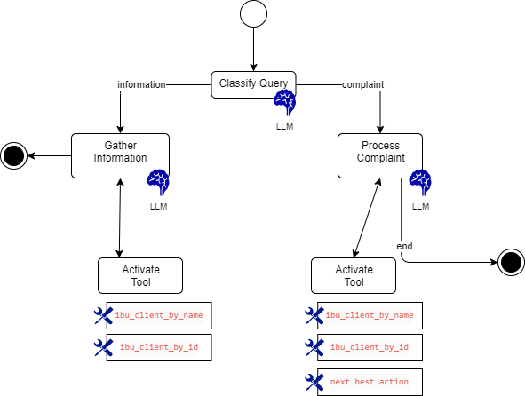{ width=900 }

*The code supporting this graph is in the [IBU_Assistant_LG.py](https://github.com/AthenaDecisionSystems/athena-owl-demos/blob/main/IBU-insurance-demo/ibu_backend/src/ibu/llm/assistants/IBU_Assistant_LG.py) and uses LangGraph API*

* The first agent, `ibu_classify_query_agent`,  has a system prompt to assess if the query is about an information query or about a complaint related to an insurance entity. The tools used to support both paths are not the same. The system prompt is `classify_query_prompt`. The agent is  `ibu_classify_query_agent`

```python
graph.add_node("gather_information", self.process_information_query)
graph.add_node("process_complaint", self.process_complaint)
graph.add_node("activate_tools_for_info", tool_node_1)
graph.add_node("activate_tools_for_complaint", tool_node_2)
```

* The gathering information agent is using a prompt to search for information, using query tools to claim or client databases and then external web search. The agent is `ibu_tool_rag_agent_limited`.

* The complaint processing agent is `ibu_tool_rag_agent`.
* The active tool nodes are taking the output for the LLM to assess the tool selections and then execute those tools, accumulates the responses to send them back to the matching agent. The tool lists are different in each agent:

```yaml title="agents.yaml file in config folder"
ibu_tool_rag_agent_limited:
  agent_id: ibu_tool_rag_agent_limited
  tools:
    - ibu_client_by_id
    - ibu_client_by_name
    - ibu_claim_by_id
    - tavily

# 
ibu_tool_rag_agent:
   agent_id: ibu_tool_rag_agent
   tools:
    - ibu_best_action
    - ibu_client_by_id
    - ibu_client_by_name
    - ibu_claim_by_id
```

To navigate in the graph conditions are added to the edges:

```py title="conditonal edge in IBU_Assistant_LG.py"
# from the gathering information node, if there is a tool call in the response then goes to activate the tools
 graph.add_conditional_edges(
    "gather_information",  # (1)
    self.route_tools,      # (2)
    { 
        "tools": "activate_tools_for_info", 
        END: END
    }
 )
```

1.  :man_raising_hand: The node with LLM
2.  :man_raising_hand: The function to decide where to route

The route tools function looks at the present of tool_calls in the LLM ai message response:

```py title="route_tools function"
 if hasattr(ai_message, "tool_calls") and len(ai_message.tool_calls) > 0:
```

### Define Agents

#### ibu_classify_query_agent

The first agent declaration uses the [`IBUClassifyQueryAgent`](https://github.com/AthenaDecisionSystems/athena-owl-demos/blob/main/IBU-insurance-demo/ibu_backend/src/ibu/llm/agents/ClassifyQueryAgent.py) class.

```yaml title="File ibu_backend/src/config/agents.yaml"
ibu_classify_query_agent:
  agent_id: ibu_classify_query_agent
  name: ibu_classify_query_agent
  description: openai based agent with simple prompt 
  class_name: ibu.llm.agents.ClassifyQueryAgent.IBUClassifyQueryAgent
  modelClassName: langchain_openai.ChatOpenAI
  modelName: gpt-3.5-turbo-0125
  prompt_ref: classify_query_prompt
  temperature: 0
  top_k: 1
  top_p: 1
```

#### ibu_tool_rag_agent

To illustrate the integration with Vector Store a specific agent: [tool_rag_agent](https://github.com/AthenaDecisionSystems/athena-owl-demos/blob/main/IBU-insurance-demo/ibu_backend/src/ibu/llm/agents/tool_rag_agent.py) is defined.

```yaml title="File ibu_backend/src/config/agents.yaml"
ibu_tool_rag_agent:
  agent_id: ibu_tool_rag_agent
  name: ibu_tool_rag_agent
  description: openai based agent with prompt with query and context
  class_name: ibu.llm.agents.tool_rag_agent.IbuToolRagAgent
  modelClassName: langchain_openai.ChatOpenAI
  modelName: gpt-3.5-turbo-0125
  prompt_ref: ibu_rag_prompt
  temperature: 0
  top_k: 1
  top_p: 1
  tools:
    - ibu_best_action
    - ibu_client_by_id
    - ibu_client_by_name
    - get_claim_status_by_user_name
    - ibu_claim_by_id
```


#### ibu_tool_rag_agent_limited

Using the same code as above but with other tools.

```yaml title="File ibu_backend/src/config/agents.yaml"
ibu_tool_rag_agent_limited:
  agent_id: ibu_tool_rag_agent_limited
  name: OpenAI IBU agent with RAG Limited
  description: OpenAI IBU agent with RAG and insurance tool without decision service
  class_name: ibu.llm.agents.tool_rag_agent.IbuToolRagAgent
  modelClassName: langchain_openai.ChatOpenAI
  modelName: gpt-3.5-turbo-0125
  prompt_ref: ibu_rag_prompt
  temperature: 0
  top_k: 1
  top_p: 1
  tools:
    - ibu_client_by_id
    - ibu_client_by_name
    - get_claim_status_by_user_name
    - ibu_claim_by_id
    - tavily
```

### Define Tools

This is one of the most important exercise. The tools are functions and declarations in manifest file. 

The get client information by using the first and last names is a function that uses a HTTP client to call the DataManager microservice, using the repository pattern:

```py title="client_tools.py"
def get_client_by_name(firstname: str, lastname: str) -> dict:
    """get client information given his or her name"""
    return build_or_get_insurance_client_repo().get_client_by_name(firstname, lastname)
```

The repository is a Singleton. 


```yaml title="Declaration in config/tools.yaml"
ibu_client_by_name:
  tool_id: ibu_client_by_name
  tool_name: "Client by lastname and firstname"
  tool_class_name: 'ibu.llm.tools.client_tools'  # (1)
  tool_description: 'get client information given his or her lastname and firstname'
  tool_fct_name: get_client_by_name
```

1. The module file name where the function is implemented

### Define instructions

System prompts are defined externally in the prompts.yaml and then referenced in the agent:

```yaml title="IBU Classify Query Agent in agents.yaml"
ibu_classify_query_agent:
  agent_id: ibu_classify_query_agent
  name: IBU Classify Query Agent
  prompt_ref: classify_query_prompt  # (1)
```

1. Reference to a system prompt.

The matching prompt:

```yaml title="Classify the query instructions in prompts.yaml"
classify_query_prompt:
  prompt_id:  classify_query_prompt
  name: Classify the query instructions
  locales:
  - locale: en
    text: >
      "You are an expert at extracting intent from user question. Assess if this is a complaint or an information gathering query.
        The information contains documents related to insurance policies, claim, coverages.
        Use complaint for questions on insurance claim status or reimbursement or unhappy customer. Only return information or complaint."
 
```

## Development activities

### Prepare a virtual environment

```sh
python -m venv .venv
# for MAC / Linux users
source ./venv/bin/activate
# for Windows
source ./venv/Scripts/activate
```

To run unit tests or integration tests, once the Python virtual environment is started be sure to set the PYTHONPATH environment variable so the athena core module can be found:

```sh
# under ibu_backend
source setpython.sh
```

### Run unit tests

All the unit tests are defined with Python [unittests](https://docs.python.org/3/library/unittest.html) library.

```sh
# under ibu_backend
pytest -s tests/ut/
```

### Debug a unit tests

The following instructions are for VScode:

* Select the test class as the python file to execute
* Start the debug and verify the launch configuration includes:

    ```json
    "configurations": [
        
        {
            "name": "Python Debugger: Current File Demos",
            "type": "debugpy",
            "request": "launch",
            "program": "${file}",
            "console": "integratedTerminal",
            "env": { "PYTHONPATH": "${workspaceRoot}/../athena-owl-core/owl-agent-backend/src"},
            "cwd": "${workspaceRoot}/IBU-insurance-demo/ibu_backend"
        }
    ]
    ```

### Physical deployment of the demonstration

As of now the owl-backend is a container image, deployable as a unit and being  able to mount the python code of the demonstration to run the different orchestration logic. The diagram illustrates those concepts to run on a local machine with the data manager microservice running in its own container

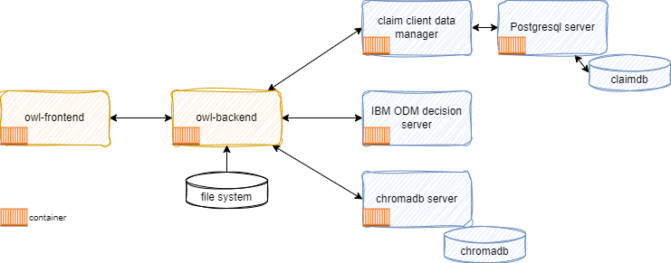{ width=800 }

For production deployment the owl-backend code and the specific logic may be packaged in its own container.
