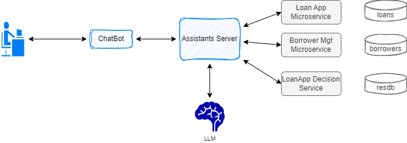
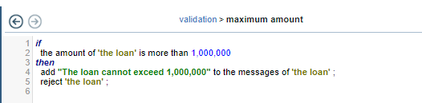
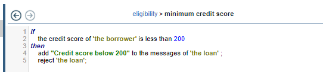
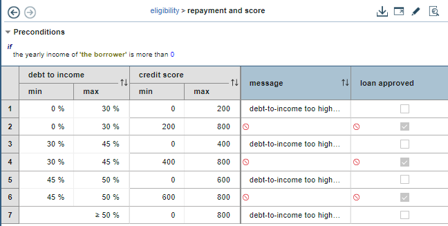
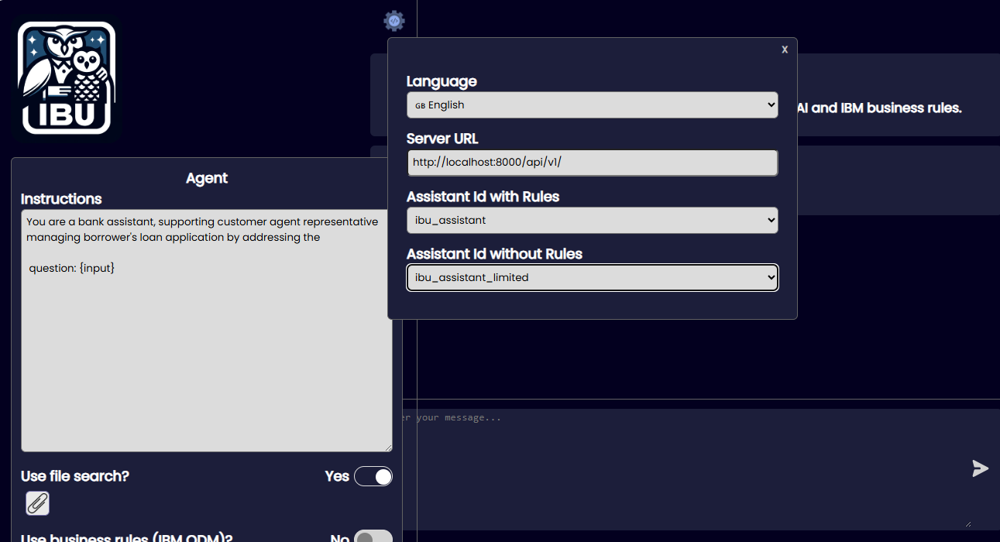
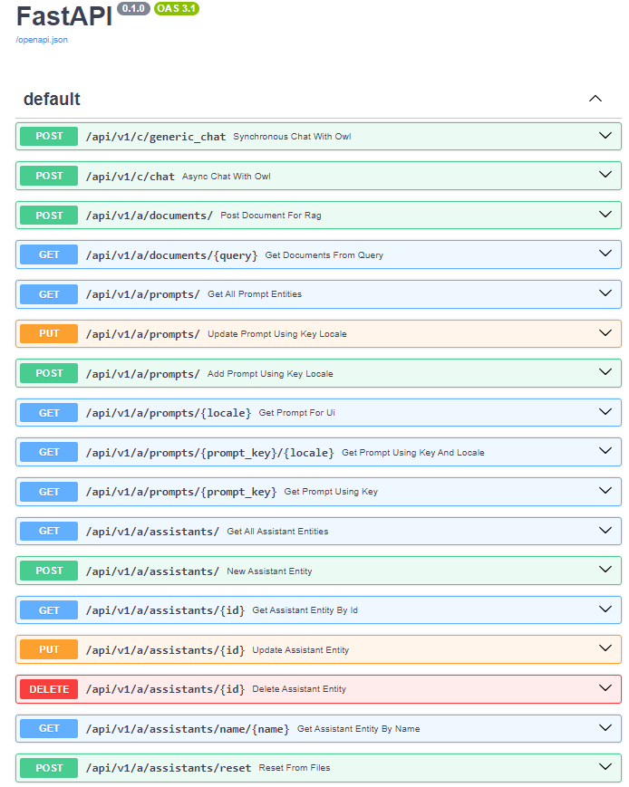
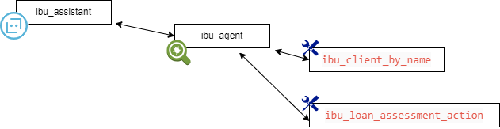
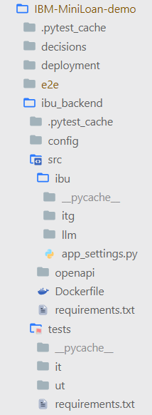
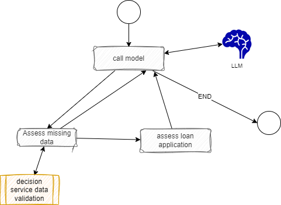

# IBM Miniloan ODM demonstration with Agent

???+ Info "Version"
    Created 06.2024

## Goals

The Miniloan application is part of the IBM Operational Decision Management product and [tutorial](https://www.ibm.com/docs/en/odm/8.12.0?topic=rules-tutorials). The goal of this hybrid AI demonstration is to illustrate how unstructured query in natural language can be decomposed using a LLM to identify parameters to call the loan application decision service and how to do it with the Owl Framework.

The end-user's questions that are tested and validated are:

* **What is the credit score of Robert Smith?**: this will demonstrate call to a backend CRM database.
* **My client robert smith wants to borrow $1,000,000 for 180 months  with a yearly repayment of $60,000 do you think it is possible?**: will illustrate the call to the miniloan ruleapp using the loan parameters extracted by the LLM.
* **One of our client, Jean Martin, wants a loan for $300,000 for a duration of 180 months and a yearly repayment of $40,000 do we approve it?**, just to demonstrate that different rules apply.


## Architecture

The high level the architecture for this demonstration looks like in the figure below:

{ width=800 }

* A chatbot supports the interactions with a customer support representative using natural language queries
* The assistant server manages the conversation and the integration with different backends. There are two assistants defined for this demonstration, one using IBM ODM MiniLoan decision service, one without it.
* The Loan App Decision service is the SAMPLE RuleApp deployed in a Rule Execution Server
* The different microservices to access the client database as future or existing borrowers, and to access the loan applications repository.
* The LLM is an externally Large Language Model accessible via API. Different models can be used.

To make it easier the loanApp and client the repositories are mockup and loaded in memory.

Recall that the rules implemented validate the data on the loan and borrower attributes:

* The max amount of money a loan could be:

{ width=800 }

* The minimum credit score the borrower needs to have:

{ width=800 }

* The yearly payment compare to the borrower incomes and credit score as a decision table:

{ width=800 }

Those rule evaluations are key to get reliable answer even if we have to process unstructured text.

For more detail on the OWL Core components [design see this note.](https://athenadecisionsystems.github.io/athena-owl-core/design/)

### Physical deployment of the demonstration

As of now the owl-backend is a container image, deployable as a unit and ables to mount the python code of the demonstration to run the different orchestration logic. The diagram illustrates those concepts to run on a local machine

{ width=800 }

For production deployment the owl-backend code and the specific logic may be packaged in its own container.

## Demonstration Flows

* Get a the API keys for the different LLM you want to use in your solution: WatsonX.AI , OpenAI Anthropic, Mistral, ... and use the `/demo_tmpl/.env_tmpl` file to persist those API KEYS, rename the file as `.env` and move it the miniloan demonstration folder.

```sh
# under IBM-miniloan-demo
cp ../demo_tmpl/.env_tmpl .env
```

* Start the docker compose with all the components of the above architecture.

```sh
cd IBM-MiniLoan-demo/deployment/local/
docker compose up -d
```

* The Frontend user interface is available at [http://localhost:3000/](http://localhost:3000/), clicking to the gear will bring the setting panel:

  { width=900 }

* The backend APIs is available at the following URL [http://localhost:8000/docs](http://localhost:8000/docs). You do not need to use it for the demonstration scenario but feel free to use to it to understand the OWL entity model.

  { width=900 }

* Run a demonstration script to validate the deployment and the integration with LLM:

```sh
# under the e2e folder
python non_regression_tests.py
```

The script validates:

  * The health if the server end-point
  * Get the default system prompt designed for the demonstration
  * Get the main assistant entity (the metadata about the assistant)
  * Get the loan agent entity
  * Get one of the tool entity to get information from a backend database
  * Makes a unstructured query to ask about one of the existing client: **What is the credit score of Robert Smith using IBU loan database?**
  * Assess a loan for a borrower with low credit score
  * Assess for a successful loan application

### Demonstrating with the User Interface

The User interface may be used to do a live demonstration:


The following figure is using the `ibu_assistant_limited` assistant to try to answer the question. The tool calling to access the client data is successful but the LLM generates hallucinations:


{ width = 900}

## Agentic with Rule Engine

This section explains how to use the OWL framework to support the demonstration. 

An assistant supports a customer representative to answer questions and queries about a loan. Assistant entity uses an agent, which is linked to the LLM to call via API and the tool definitions.

{ width=900 }

* The assistant definition is simple and uses the BaseAssistant class from the Owl framework which uses LangChain's chain construct with or without tools definition.

```yaml
ibu_assistant:
  assistant_id: ibu_assistant
  class_name: athena.llm.assistants.BaseAssistant.BaseAssistant
  description: A default assistant that uses LLM, and local defined tools like get borrower, and next best action
  name: IBU Loan App assistant
  agent_id: ibu_agent
```

The assistant without ODM decision service function is:

```yaml
ibu_assistant_limited:
  assistant_id: ibu_assistant_limited
  class_name: athena.llm.assistants.BaseAssistant.BaseAssistant
  description: A default assistant that uses LLM, and local defined tools like get borrower, without decision service
  name: IBU Loan App assistant
  agent_id: ibu_agent_limited
```

* The agent entity definition lists the prompt, and tools to use, and the LLM model. The `langchain_openai.ChatOpenAI` class is part of the langchain library. So a class that wraps a specific LLM API can be used.  

```yaml
ibu_agent:
  agent_id: ibu_agent
  name: ibu_agent
  description: openai based agent with IBU loan app prompt and tools
  class_name: athena.llm.agents.base_chain_agent.OwlAgent
  modelName: gpt-3.5-turbo-0125
  modelClassName: langchain_openai.ChatOpenAI
  prompt_ref: ibu_loan_prompt
  tools:
  - ibu_client_by_name
  - ibu_loan_assessment_action
```

* Tool definition looks to access data about the borrower/ client references the class that implement the tool function. The description is very important and represents a system prompt the LLM will use in the context window to infer the good data extraction from the unstructured query.

```yaml
ibu_client_by_name:
  tool_id: ibu_client_by_name
  tool_class_name: 'ibu.llm.tools.client_tools'
  tool_description: 'get client information given his or her name'
  tool_fct_name: get_client_by_name
```

* For the decision service, the same approach with a different function name.

```yaml
ibu_loan_assessment_action:
  tool_id: ibu_loan_assessment_action
  tool_class_name: ibu.llm.tools.client_tools
  tool_description: 'perform the loan application request assessment for the given borrower name'
  tool_fct_name: assess_loan_app_with_decision
```

Assistants, agents and prompts are declarative. Tools need declaration but some code to do the integration. 

## Development around the demonstration

In case you need to work on the current demonstration, and run some of the test cases, this section addresses what needs to be done to run on you own local laptop (or a VM on the cloud) with a Docker engine. Currently, in development mode, the source code of the core framework is needed so you need to clone the github repository ( in the future, we may build a module that should be installable via `pip install`).

```sh
# for example in $HOME/Code/Athena

git clone https://github.com/AthenaDecisionSystems/athena-owl-core
```

### Unit tests

* Define the PYTHONPATH so the core modules can be accessed during the tests executions:

```sh
    export PYTHONPATH=$WHERE_YOUR_CODE_IS/athena-owl-core/owl-agent-backend/src
```

* Install specific library for testing

```sh
# under ibu-backend
pip install -r tests/requirements.txt
```

* Run all unit tests for the Miniloan:

```sh
# under ibu-backend
pytest -s tests/ut
```

### Integration tests

For integration tests, you need to start the backend using Docker Compose as explained [before](#demonstration-flows), then run all the integration tests via the command:


```sh
# under ibu-backend
pytest -s tests/it
```

### Code Explanations

The [previous section](#agentic-with-rule-engine) demonstrates the Yaml manifests for the declaration of the assistant, agent and tools. Each demonstration will have different tools. This section explains the tools implemented in this demonstration which may help for future development.

#### Code structure

Each demonstration is its own folder and includes mostly the same structure:



| Folder | Intent |
| --- | --- |
| **decisions/persistence** | Include the resDB ruleApps from IBM ODM |
| **deployment** | Infrastructure as code and other deployment manifests |
| **e2e** | end to end testing for scenario based testing with all components deployed |
| **ibu_backend/src** | The code for the demo |
| **ibu_backend/openapi** | Any openAPI documents that could be used to generate Pydentic objects. ODM REST ruleset openAPI is used.|
| **ibu_backend/config** | The different configuration files for the Agentic solution entities |
| **ibu_backend/tests** | Unit tests (**ut** folder) and integration tests (**it** folder) |

#### Focusing on tools

The tool function coding is done in one class, the [client_tools.py](https://github.com/AthenaDecisionSystems/athena-owl-demos/blob/main/IBM-MiniLoan-demo/ibu_backend/src/ibu/llm/tools/client_tools.py). This class implements the different functions to be used as part of the LLM orchestration, and also the factory to build the tool for the LangChain framework.

Taking the tool definition below

```yaml
ibu_loan_assessment_action:
  tool_id: ibu_loan_assessment_action
  tool_class_name: ibu.llm.tools.client_tools
  tool_description: 'perform the loan application request assessment for the given borrower name'
  tool_fct_name: assess_loan_app_with_decision
```

The module `ibu.llm.tools.client_tools` includes the function [`assess_loan_app_with_decision`](https://github.com/AthenaDecisionSystems/athena-owl-demos/blob/2790a24a3ca6e7c1e3170a7b28aae4e036403b5b/IBM-MiniLoan-demo/ibu_backend/src/ibu/llm/tools/client_tools.py#L50-L62) that exposes the parameters the LLM can extract from the unstructured text and gives back to the langchain chains to perform the tool calling. The code prepares the payload to the ODM service.


### Future enhancement

It is clear that the unstructured query is key to get good tool calling. It is possible to add a ODM rule set for data gathering. Any required data attributes needed to decide on the loan application may be evaluate from what the LLM was able to extract. LLM can build json payload conforms to a schema. Adding an agent to look at the data of the json, will help asking the question to the human to get all the missing data.

{width=900}

## Next 

[As a next step you can study how to create your own demonstration >>>](build_sol.md)


