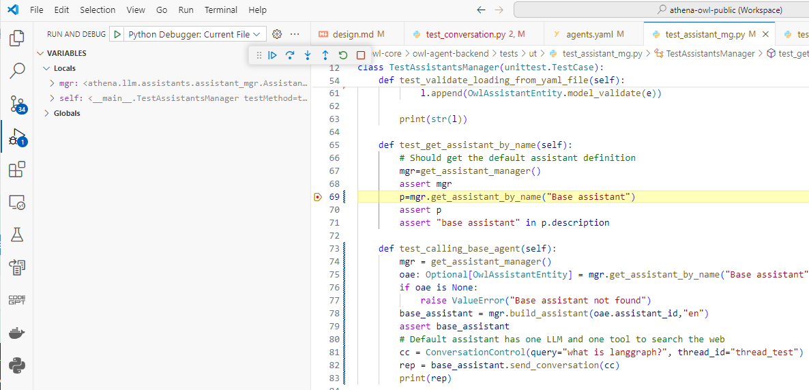
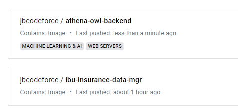

# Owl Agent Backend Design

For tuning and enhancing the OWL backend the code is in [athena-owl-core/owl-agent-backend](https://github.com/AthenaDecisionSystems/athena-owl-core/tree/main/owl-agent-backend), this chapter explains the code and implementation approach, and then how to continue developing and testing the backend.

## Code organization

The code for the backend is in the `src` folder, while unit tests and integration tests are under `tests/ut/` and `tests/it`.

The main entry point for the owl-backend is the [athena.main.py](https://github.com/AthenaDecisionSystems/athena-owl-core/blob/main/owl-agent-backend/src/athena/main.py) which is a FastAPI server.
The backend can run in uvicorn or ugnicorn server. It exposes two set of APIs: 

* `/api/v1/c/` pour the conversation 
* `/api/v1/a/` for the administration like managing the different entities of the frameworks: assistants, agents, prompts, RAG documents

The src folder includes the Dockerfile to build the image, the requirements.txt for dependencies and a `start_backend.sh` script to do local development tests. Unit and integration test are done using pytest and unittest modules. Code testing can be debugged in VScode IDE.

## Important components

The [architecture document presents the components](arch.md/#component-view). The decomposition is done with API, service/repository code and then llm specific code.


| Folder | Functions |
| --- | --- |
| **routers** | Includes the different REST resources: conversation, assistant, agent, tool, prompt and document |
| **config** | Configuration file when the application runs in container. The configuration files are mounted inside the container under /app |
| **itg** | This is for the integration, so most of the code there is mockup placeholder for demonstration, the only important component is the store to keep data about the files uploaded in the context of RAG |
| **llm** | The different repository to manage each OwlEntities like, assistant, agent, tools, prompts...There are also some pre-defined assistants and agents that could be used for integrating in solution |


### Conversation

The conversation API is in [routers/conversations.py](https://github.com/AthenaDecisionSystems/athena-owl-core/blob/main/owl-agent-backend/src/athena/routers/conversations.py). 


The conversation manager [conversation_mgr.py](https://github.com/AthenaDecisionSystems/athena-owl-core/blob/main/owl-agent-backend/src/athena/llm/conversations/conversation_mgr.py) under `llm/conversations` folder exposes a factory method to create or get in the cache the assistant supporting the conversation. 
When an assistant is not in the memory, the factory delegates to the assistant manager the creation of the assitant.

Conversation uses a ConversationControl bean class. The definitions of those classes are in a DTO model so it can be easily shared with other app.

From the user interface the end user may select another assistant, and in this case a new thread should be started. When assistant uses implementation with Stateful capability, like in LangGraph, then the conversation will be saved as part of the memory management of LangGraph using the thread unique identifier.

An example of simple query to Anthropic Claude using an assistant that has Tavily search tool. The payload to the POST url is

```json
{
 
  "query": "what is the Athena Decision Systems company? about",
  "user_id": "jerome",
  "assistant_id": "base_tool_assistant",
  "thread_id": "1"
}
```

### Assistant

The Assistant manager is in [llm/assistants](https://github.com/AthenaDecisionSystems/athena-owl-core/tree/main/owl-agent-backend/src/athena/llm/assistants) folder. The current implementation is using local repository as file system. The assistant also exposes a factory method to create assistant executor using the AssistantEntity information.


The validation unit tests are in [tests/ut/test_assistant_mg.py](https://github.com/AthenaDecisionSystems/athena-owl-core/blob/main/owl-agent-backend/tests/ut/test_assistant_mg.py) and for the integration tests  [tests/it/test_assistants_api.py]

The `llm/assistants` folder includes some pre-defined assistants:

| Assistant | Description |
| --- | --- |
| BaseAssistant | A default assistant to do simple LLM calls |
| Default tool assistant | Default tool assistant |
| Claude 3 with tool assistant | | 

The configuration of the assistants are in the [config/assistants.yaml](https://github.com/AthenaDecisionSystems/athena-owl-core/blob/main/owl-agent-backend/src/athena/config/assistants.yaml) files

```yaml
base_tool_assistant:
  assistant_id: base_tool_assistant
  class_name: athena.llm.assistants.BaseToolAssistant.BaseToolAssistant
  description: A default assistant that uses LLM and search tool to do web search
  name: Default tool assistant
  agent_id: open_ai_tool
```

The Assistant implementation can be a Langchain chain or a langGraph graph. Each assistant needs to implement the send_conversation and streaming method.

```python
def send_conversation(self, controller: ConversationControl) -> ResponseControl | Any:
```

### Agents


The Agent manager is in [llm/agents](https://github.com/AthenaDecisionSystems/athena-owl-core/tree/main/owl-agent-backend/src/athena/llm/agents) folder. The current implementation is using local repository as file system. The agent manager also exposes a factory method to create agent executor using the AgentEntity information.


Example of AgentEntity

```yaml
open_ai_tool:
  agent_id: open_ai_tool
  name: open_ai_gpt35
  description: openai based agent with prompt coming from langchain hub  and tool
  class_name: athena.llm.agents.tool_agent_openai.OpenAIToolAgent
  modelName: gpt-3.5-turbo-0125
  prompt_ref: hwchase17/openai-functions-agent
  temperature: 0
  top_k: 1
  top_p: 1
  tools:
  - tavily
```

The validation unit tests are in [tests/ut/test_agent_mg.py](https://github.com/AthenaDecisionSystems/athena-owl-core/blob/main/owl-agent-backend/tests/ut/test_agent_mg.py) and for the integration tests  [tests/it/test_agents_api.py]

The `llm/agents` folder includes some pre-defined agents:

| Agent | Description |
| --- | --- |
| Fake Agent | To do unit testing without cost |
| open_ai_gpt35 |  openai based agent with simple prompt |
| Open_ai_tool | openai based agent with prompt coming from langchain hub  and tool |
| Agent anthropic with tools | Claude 3 with tool calling |

The configuration of the agents are in the [config/agents.yaml](https://github.com/AthenaDecisionSystems/athena-owl-core/blob/main/owl-agent-backend/src/athena/config/agents.yaml) files


### Tools


## Running locally

### Pre-requisites

* Prepare your .env file, using your personal Keys

```yaml
OPENAI_API_KEY=---your-key---
WATSONX_APIKEY=---your-key---
MISTRAL_API_KEY=---your-key---
LANGCHAIN_API_KEY=---your-key---
LANGCHAIN_TRACING_V2=true
LANGCHAIN_ENDPOINT=https://api.smith.langchain.com
...
```

* Create and start virtual python env (once created just activate it). Test with python 3.12.3. Above that there is some incompatibility with langchain modules (as of 6/15/2024).

```sh
python -m venv .venv
# for MAC users
source ./venv/bin/activate
# for Windows
source ./venv/Scripts/activate
```

* Install the needed python modules with `pip install -r src/requirements.txt` and `pip install -r tests/requirements.txt`

### Development mode

While developing the backend, the approach is to use test-driven development and start by the unit tests. Each unit test python file define a unittest.TestCase class and then test method. For each entity manager instantiate a manager and then do some testing of the api.

For conversation, use the ConversationControl object.

```python
def test_base_assistant_with_chat_history(self):    
    cc = ConversationControl()
    cc.assistant_id="base_assistant"
    cc.user_id="unit_test"
    cc.thread_id="1"
    cc.chat_history=[]
    cc.query="Hi, I'm Bob and my last name is TheBuilder."
    rep = get_or_start_conversation(cc)
    assert rep
    assert rep.message
```

It is also possible to start a uvicorn server with continuous upload of the code and then test using the OpenAI exposed.

1. Start the server under the `src` folder with `./start_backend.sh`. It uses a special config file (named [local-config.yaml](https://github.com/AthenaDecisionSystems/athena-owl-core/blob/main/owl-agent-backend/src/local-config.yaml)) to access the other entities configurations.
1. Use the [localhost:8000/docs](http://localhost:8000/docs) URL
1. Use any of the entity APIs
1. Use the generic/chat URL to send the conversation.

The minimum payload to use one of the assistant is the following:

```json
{
  "query": "what is the Athena Decision Systems company about?",
  "user_id": "jerome",
  "assistant_id": "fake_assistant",
  "thread_id": "1"
}
```

### Run unit tests

Running all the tests for non-regression validation:

```sh
pytest -s tests/ut/
```

To debug unit tests in VSCode:

* As the src code and tests are in separate folders, be sure to have configured the debugger launch settings as:

```json
{
    "version": "0.2.0",
    "configurations": [
        
        {
            "name": "Python Debugger: Current File",
            "type": "debugpy",
            "request": "launch",
            "program": "${file}",
            "console": "integratedTerminal",
            "env": { "PYTHONPATH": "${workspaceRoot}/owl-agent-backend/src"},
            "cwd": "${workspaceRoot}/owl-agent-backend"
        }
    ]
}
```

Then breakpoint and step by step.



### Integration mode

There are two ways to do integration tests, with docker or with the start_backend.sh script.

* build the agent backend image under the owl-agent-backend folder.

```sh
./build/buildImage.sh
```

This image can be pushed to docker hub. (as of now it is the `jbcodeforce/athena-owl-backend:latest` image)

