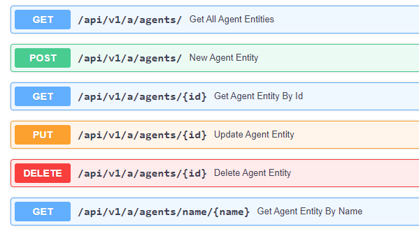

# Owl Agent Backend Design

This chapter explains the design, code, and implementation approach, of the OwlAgent Framework backend and how to continue developing and testing it.

The framework's code is in the GitHub repository [athena-owl-core/owl-agent-backend](https://github.com/AthenaDecisionSystems/athena-owl-core/tree/main/owl-agent-backend).

## The core concepts

The core concepts the framework manages are agents, tools, and prompts.   An _agent_ is a deployable application built up by choreographing one or more _llm_, each with its own workflow that can leverage external _tools_, guided by _prompts_.

Here is a how they are related:

{ width=900 }

An _agent_ is an interactive application or solution that supports a specific business use case, like helping a worker performing a specific task of a business process.  The execution of the agent involves the coordination of one or more LLMs.  Agents may be stateful to preserve the state of a conversation using snapshot capabilities.

An _Agent_ manages a co-ordinated set of calls to a Large Language Model,  with a prompt and tools, to accomplish a subtask. A _retriever_ is a tool that can access a document or collection of documents in a vector store. So implementing RAG in the OwlAgent Framework means using a retriever tool inside an agent.

## Code organization

To find the code for the back-end, first clone the OwlAgent Framework core repository:

```sh
git clone AthenaDecisionSystems/owl-agent-core
```

Then look in the `athena-owl-core/owl-agent-backend` directory:

```sh
cd athena-owl-core/owl-agent-backend
```

The code for the backend is in the `src` folder, while unit tests and integration tests are under `tests/ut/` and `tests/it` respectivily.

The backend runs as a server that can support multiple agents simultaneously. The backend is typically run in a Docker container and then accessed as a set of REST APIs. It is implemented using [FastAPI](https://fastapi.tiangolo.com/). We recommend using Python 3.12 for development.

The main entry point for the owl-backend is found in the Python file [athena.main.py](https://github.com/AthenaDecisionSystems/athena-owl-core/blob/main/owl-agent-backend/src/athena/main.py) which is the core of the FastAPI server.   Other files implement different endpoint APIs that the backend server exposes; each one is considered a different component implementing a different set of related features of the backend.

The backend can run in the uvicorn or ugnicorn server (the defaults for FastAPI). It exposes two set of APIs:

* `/api/v1/c/` for managing conversations with the user, typically exposed in a chatbot user interface.  (The OwlAgent Framework frontend server is the default user interface but others can be developed by calling these API's directly.)
* `/api/v1/a/` for administration tasks, such as managing the different OWL entities of the frameworks: agents, prompts, or tools.

The `src` folder includes the Dockerfile to build the image, the `requirements.txt` for specifying Python module dependencies and a `start_backend.sh` script to enable local development tests. Unit and integration test are done using `pytest` and unittest modules. Code testing can be debugged in the VSCode IDE.

Before starting work on the backend, it's important to set up your own Python virtual environment.   Make sure you have [Python 3.12](https://www.python.org/downloads/) installed and available as the command `python`, as well as `pip`.

```sh
python -m venv venv # you can choose your own name of course
source venv/bin/activate # on Windows type 'venv\Scripts\activate'
cd athena-owl-core/owl-agent-backend/src
pip install -r requirements.txt
```

## Important components

The [architecture document presents the components](arch.md/#component-view). Each component has its APIs implemented with service /repository code, and then LLM-specific facade code as needed.

### Conversation

The conversation API is in [routers/conversations.py](https://github.com/AthenaDecisionSystems/athena-owl-core/blob/main/owl-agent-backend/src/athena/routers/conversations.py).

An OwlAgent conversation is very similar to a _thread_ in the [OpenAI Assistant API](https://platform.openai.com/docs/assistants/overview).


The conversation manager [conversation_mgr.py](https://github.com/AthenaDecisionSystems/athena-owl-core/blob/main/owl-agent-backend/src/athena/llm/conversations/conversation_mgr.py) in the `llm/conversations` folder exposes a factory method to create, or get from the cache, the agent supporting the conversation.

When an agent is not in memory, the factory delegates the creation of the agent to the agent manager.  (It sounds like middle management work, doesn't it?)

`Conversation` uses a `ConversationControl` bean class to describe its state and parameters. The definitions of these classes are in a DTO (Data Transfer Object) model so it can be easily shared with other apps.

If in the user interface, the end user selects another agent for their interactions, a new conversation should be started. When an agent has a stateful implementation, such as LangGraph, then the conversation will be saved as part of the memory management of LangGraph using the thread's unique identifier.

Here is an example of a simple query to the Anthropic Claude LLM using an agent that has Tavily search tool. The payload to the POST url is

```json
{
 
  "query": "What does the Athena Decision Systems company do?",
  "user_id": "joel",
  "agent_id": "base_tool_graph_agent",
  "thread_id": "1"
}
```

From a conversation interaction, the sequence flow looks like in the following sequence diagram:


The Agent Runners are instances created by factory classes using the parameters read in the appropriate agent definition.  These definitions are stored in yaml files as described below.

### Agents

Agent management has two parts: 1/ the management of the OwlAgent entity definitions with REST resources and a persistence repository, and 2/ the agent runner instance which manages conversations:


#### Agent Entity Management

The agent REST resource defines the FastAPI router (see code in `routers/agents.py`) and the CRUD verbs.



The REST resource and APIs are defined in [agents.py](https://github.com/AthenaDecisionSystems/athena-owl-core/blob/main/owl-agent-backend/src/athena/routers/agents.py).

The following code illustrates simple delegation to the agent manager:

```python
from athena.llm.agents.agent_mgr import get_agent_manager, OwlAgent

router = APIRouter( prefix= get_config().api_route +"/a")

@router.get("/agents/{id}")
def get_agent_entity_by_id(id: str) -> OwlAgentEntity:
    return get_agent_manager().get_agent_by_id(id)

```

The Agent manager is in [llm/agents](https://github.com/AthenaDecisionSystems/athena-owl-core/tree/main/owl-agent-backend/src/athena/llm/agents) folder. The current implementation uses a local file to keep [OwlAgent definitions](https://github.com/AthenaDecisionSystems/athena-owl-core/blob/main/owl-agent-backend/src/athena/config/agents.yaml) . The agent id needs to be unique among the declaration of all agents.

```python
class OwlAgent(BaseModel):
    agent_id: str 
    name: str 
    description: Optional[str]
    modelName: str 
    modelClassName: Optional[str] 
    class_name: str 
    prompt_ref:  str 
    temperature: int = 0 
    top_k: int = 1
    top_p: int = 1
    tools: list[str] = []
```

The name is purely for user interface display as is the description. The description should clearly state the intent of the agent for a human end user. An agent includes one system prompt (see the [prompt design below](./design.md/#prompts)). As of now the `modelClassName` must name a class from the LangChain chat API. The `modelName` is the specific LLM name to use. An agent can have 0 to many tools.

Here is an example of an OwlAgent definition:

```yaml
openai_tool_chain:
  agent_id: openai_tool_chain
  name: open_ai_gpt35
  description: openai based agent with prompt coming from langchain hub  and tool
  runner_class_name: athena.llm.agents.agent_mgr.OwlAgentDefaultRunner
  modelName: gpt-3.5-turbo
  modelClassName: langchain_openai.ChatOpenAI
  prompt_ref: openai_functions_prompt
  temperature: 0
  top_k: 1
  top_p: 1
  tools:
  - tavily
```

#### Agent Runner

The agent manager exposes a factory method to create agent executor using the OwlAgent entity information. The LLM class is also define in the descriptor.

The validation unit tests are in [tests/ut/test_agent_mg.py](https://github.com/AthenaDecisionSystems/athena-owl-core/blob/main/owl-agent-backend/tests/ut/test_agent_mg.py) and the integration tests  in [tests/it/test_agents_api.py](https://github.com/AthenaDecisionSystems/athena-owl-core/blob/main/owl-agent-backend/tests/it)

The `llm/agents` folder includes some pre-defined agents (new ones being added regularly):

| Agent | Description |
| --- | --- |
| fake_agent | To do unit testing without cost |
| OwlAgentDefaultRunner | The default agent runnung using Langchain chain, and dynamic instantiation of the LLM class | 
| base_graph_agent |   A default agent to do simple LLM calls including tool calling. It uses one agent with a LangChain chain. LLM is pluggable|
| Base Tool Graph Agent | A LangGraph flow with an agent and tool nodes, like the ReAct pattern. |

The configuration of the agents are in the [config/agents.yaml](https://github.com/AthenaDecisionSystems/athena-owl-core/blob/main/owl-agent-backend/src/athena/config/agents.yaml) files


You can approach new agent development in a few ways:

1. Use existing agent code and define new tools and prompts.
1. Use existing agents and combine them in a LangGraph graph with tools and prompts using a new agent implementation.
1. Develop a new agent code for a new LLM, with a new prompt and tools.


### Tools

The concept of calling external tools, also called functions, was introduced by OpenAI, and most major LLMs now support it.

Here is an example of python function that can be used as a tool:

```python
def query_crm_backend(query: str):
    """Call the customer relationship management (CRM) to get customer data."""

    return ["The customer records from DEMO CRM"]
```

An example of this function as a tool is in [demo_tools.py](https://github.com/AthenaDecisionSystems/athena-owl-core/blob/main/owl-agent-backend/src/athena/llm/tools/demo_tools.py)

The OWL Framework uses a tool factory to create tool references used by LLM API.

#### Langchain tool API

The simple way to add tools to an LLM instance in LangChain is to define an AgentExecutor, which combines an LLM and a prompt with the tool names.

```python
agent = LLMSingleActionAgent(llm_chain=llm_chain, output_parser=output_parser,
    stop=["\nObservation:"], allowed_tools=tool_names,
)
agent_executor = AgentExecutor.from_agent_and_tools(agent=agent, tools=tools)
```

`tool_names` is a list of strings of the names of the tools, while `tools` is a list of python functions implementing the names.

Zooming to the prompt, it needs to include placeholders for tools and tool_names:

```text
**Answer the following questions as best you can, but speaking as a pirate might speak. You have access to the following tools:**

**{tools}**

Use the following format:

Question: the input question you must answer
Thought: you should always think about what to do
Action: the action to take, should be one of **[{tool_names}]**
Action Input: the input to the action
Observation: the result of the action
... (this Thought/Action/Action Input/Observation can repeat N times)
Thought: I now know the final answer
Final Answer: the final answer to the original input question
Question: **{input}** \n    **{agent_scratchpad}**
```

The Python module that manages the prompt needs to implement the tool factory class:

```python
from athena.llm.tools.tool_factory import ToolInstanceFactoryInterface
class DemoToolInstanceFactory(ToolInstanceFactoryInterface):
  def build_tool_instances(self, tool_entities: list[OwlToolEntity]) -> list[Any]:
```

This factory uses LangChain to build StructuredTool:

```python
def build_tool_instances(self, tool_entities: list[OwlToolEntity]) -> list[Any]:
    """ From the list of tools to use build the function reference for LLM """
    tool_list=[]
    for tool_entity in tool_entities:
        tool_list.append(self.define_tool(tool_entity.tool_description, tool_entity.tool_fct_name, tool_entity.tool_arg_schema_class))
    return tool_list
```

The `tools.yaml` file includes the definition of the tool as a OwlEntity:

```yaml
query_crm:
  tool_id: query_crm
  tool_class_name: athena.llm.tools.demo_tools
  tool_description: """Call the customer relationship management (CRM) to get customer data."""
  tool_fct_name: 'query_crm_backend' 
```

When creating the agent, the tool definitions are loaded and then passed to the `build_tool_instances()` function. See [the code]()

_[HED] How do the tool descriptions and the tool parameters and their descriptions get used?_

### Prompts

_TBD_

### Document management

When a user uploads a document using the chatbot interface, the file is persisted in a cloud object storage with some metadata. The file is parsed into sub-documents or chunks that are vectorized via `Embeddings`. The created vectors are saved in a vector store. The [architecture section](./arch.md/#agent-manager) showed an overview of vector store processing.

The REST resource is in the [document.py file](https://github.com/AthenaDecisionSystems/athena-owl-core/blob/main/owl-agent-backend/src/athena/routers/documents.py). It has two APIs, one for similarity search and one to upload a document. In this snippet, `file_description` represents the file's metadata and `myFile` the binary stream coming from the client application:

```python
@router.post("/documents/")
async def post_document_for_rag( file_description: FileDescription = Depends(), myFile: UploadFile = File(...)):
    # delegate to the document manager
```

The document manager is in the [itg/store/content_mgr.py](https://github.com/AthenaDecisionSystems/athena-owl-core/blob/main/owl-agent-backend/src/athena/itg/store/content_mgr.py) file. The logic to process the uploaded file is:

1. Persist the metadata file and potentially the file content itself in the storage URI as specified in the `config.yaml` file: `owl_agent_content_file_path`.
1. From the document type, perform chunking and embedding separately, as the libraries to parse and split the main document are different.
1. Create embeddings and save them in the vector store in the collection as defined by the config file.

The content_mgr offers a `get_retriever()` method to be using in LLM RAG implementation.
