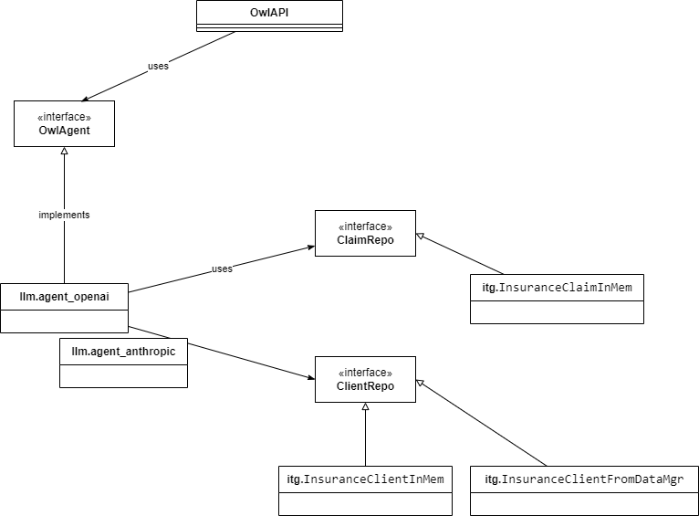

# OwlAgent design

## Class Diagram

Two important Resources:

1. Conversation to expose question and answer or chat endpoints. It delegates to OwlAgent
1. Document to expose upload document and do semantic query into the content manager. It delegates to ContentManager