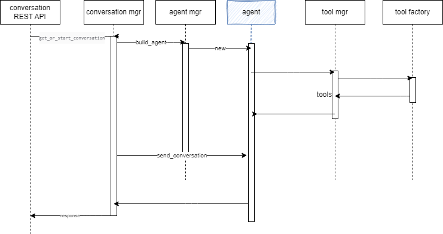

# Owl Agent Backend Design

For modifying and enhancing the OwlAgent Framework backend, the code is in [athena-owl-core/owl-agent-backend](https://github.com/AthenaDecisionSystems/athena-owl-core/tree/main/owl-agent-backend). This chapter explains the code and implementation approach, and then how to continue developing and testing the backend.

## The core concepts

The core concepts the framework manages are assistants, agents, tools, and prompts.  Here is a how they are related:

{ width=900 }

An *Assistant* supports a specific business use case, like helping a worker in a specific task of a business process, which may involve the coordination of multiple agents. Assistants may be stateful to keep state of the conversation with snapshot capabilities.

An *Agent* is a grouping of Large Language Model or fine tuned smaller Language Models, each with a prompt and tools, to accomplish a subtask of the assistant. A *retriever* is a tool to access a collection or document within a vector store. So using RAG means using a retriever. 

## Code organization

The code for the backend is in the `src` folder, while unit tests and integration tests are under `tests/ut/` and `tests/it`.

The main entry point for the owl-backend is the [athena.main.py](https://github.com/AthenaDecisionSystems/athena-owl-core/blob/main/owl-agent-backend/src/athena/main.py) which is a FastAPI server.

The backend can run in uvicorn or ugnicorn server. It exposes two set of APIs: 

* `/api/v1/c/` for the conversation with chatbot user interface
* `/api/v1/a/` for the administration tasks, such as managing the different OWL entities of the frameworks: assistants, agents, prompts, tools, RAG documents...

The `src` folder includes the Dockerfile to build the image, the `requirements.txt` is used for Python module dependencies and a `start_backend.sh` script to do local development tests. Unit and integration test are done using `pytest` and unittest modules. Code testing can be debugged in VScode IDE.

## Important components

The [architecture document presents the components](arch.md/#component-view). The decomposition is done with API, service/repository code and then llm specific facade code.

### Conversation

The conversation API is in [routers/conversations.py](https://github.com/AthenaDecisionSystems/athena-owl-core/blob/main/owl-agent-backend/src/athena/routers/conversations.py). 


The conversation manager [conversation_mgr.py](https://github.com/AthenaDecisionSystems/athena-owl-core/blob/main/owl-agent-backend/src/athena/llm/conversations/conversation_mgr.py) under `llm/conversations` folder exposes a factory method to create, or get from the cache, the assistant supporting the conversation. 
When an assistant is not in the memory, the factory delegates to the assistant manager the creation of the assistant.

Conversation uses a ConversationControl bean class. The definitions of those classes are in a DTO model so it can be easily shared with other app.

From the user interface the end user may select another assistant, and in this case a new thread should be started. When assistant uses implementation with Stateful capability, like in LangGraph, then the conversation will be saved as part of the memory management of LangGraph using the thread unique identifier.

Here is an example of a simple query to the LLM Anthropic Claude using an assistant that has Tavily search tool. The payload to the POST url is

```json
{
 
  "query": "What does the Athena Decision Systems company do?",
  "user_id": "jerome",
  "assistant_id": "base_tool_assistant",
  "thread_id": "1"
}
```

From a conversation interaction the sequence flow looks like in the following sequence diagram:



The Assistant and Agent are instance created by different factory taking into account the yaml definition of the matching Entity.

### Assistants

The Assistant manager is in [llm/assistants](https://github.com/AthenaDecisionSystems/athena-owl-core/tree/main/owl-agent-backend/src/athena/llm/assistants) folder. 

The assistant management can be seen as two folds: 1/ the management of the entity definitions with REST resource and a persistence repository, and 2/ the assistant instance which is supporting the conversation:


#### Assistant Entity Management

The assistant REST resource defines the FastAPI router (see code `routers/assistants.py`) and the CRUD verbs. 


The REST resource and APIs are defined in [assistants.py](https://github.com/AthenaDecisionSystems/athena-owl-core/blob/main/owl-agent-backend/src/athena/routers/assistants.py). 

```python
   
router = APIRouter( prefix= get_config().api_route +"/a")

@router.get( "/assistants/")
def get_all_assistants() -> List[OwlAssistantEntity]:
   all = get_assistant_manager().get_assistants()
   ...
```

The code delegates to a [repository](https://github.com/AthenaDecisionSystems/athena-owl-core/blob/e45d0aa1072b602fd875bb621c3cf1bec8d05a97/owl-agent-backend/src/athena/llm/assistants/assistant_mgr.py#L82). The current implementation uses the local file to persist assistant entity definitions. The entity is `OwlAssistantEntity` which maps the definition of the yaml below.


```yaml
base_openai_tool_assistant:
  assistant_id: base_openai_tool_assistant
  class_name: athena.llm.assistants.BaseAssistant.BaseAssistant
  description: A default assistant that uses LLM using chain with tool calling
  name: Base openai tool assistant
  agents: 
    - openai_tool_chain
```

There is only one manager per deployed Owl Framework backend, so it implements the Singleton pattern.

To access to an assistant manager, testing code uses the following approach:

```py
from athena.llm.assistants.assistant_mgr import get_assistant_manager
mgr = get_assistant_manager()
```

#### Assistant Executor

The assistant manager exposes a factory method to create assistant executor using the `OwlAssistantEntity` information.

```py
def build_assistant(self, assistant_id : str, locale: str) -> OwlAssistant:
```

As of now the local is used to select the different version of the system prompt instruction. We are still assessing if this is needed: we may move to english based system prompt and add specific parameter to generate the answer in the different locale.

See the validation unit test in [tests/ut/test_assistant_mg.py](https://github.com/AthenaDecisionSystems/athena-owl-core/blob/main/owl-agent-backend/tests/ut/test_assistant_mg.py) and the integration tests [tests/it/test_assistants_api.py](ttps://github.com/AthenaDecisionSystems/athena-owl-core/blob/main/owl-agent-backend/tests/it/test_assistants_api.py)

The `llm/assistants` folder includes some pre-defined assistant implementations:

| Assistant | Description |
| --- | --- |
| BaseAssistant | A default assistant to do simple LLM calls, with function calling. It uses one agent with a langchain chain. |
| A Graph assistant | A langgraph with agent with a single node to call a LLM |
| Base tool Graph assistant | A langgraph with agent and tool nodes, like the ReAct pattern. |


While the configuration of the assistants are in the [config/assistants.yaml](https://github.com/AthenaDecisionSystems/athena-owl-core/blob/main/owl-agent-backend/src/athena/config/assistants.yaml) file. Review the content of this file to see the last implemented assistants.


We can have multiple different assistant definitions for the same assistant implementation class. The variable dimensions are the prompt, the tools, and the LLMs used.

The [assistant_mgr](https://github.com/AthenaDecisionSystems/athena-owl-core/blob/main/owl-agent-backend/src/athena/llm/assistants/assistant_mgr.py) module defines the [`OwlAssistantEntity`](https://github.com/AthenaDecisionSystems/athena-owl-core/blob/e45d0aa1072b602fd875bb621c3cf1bec8d05a97/owl-agent-backend/src/athena/llm/assistants/assistant_mgr.py#L72-L80) class to keep Assistant declarative metadata and the [`OwlAssistant`](https://github.com/AthenaDecisionSystems/athena-owl-core/blob/e45d0aa1072b602fd875bb621c3cf1bec8d05a97/owl-agent-backend/src/athena/llm/assistants/assistant_mgr.py#L17-L68) abstract class.


The Assistant implementation can be done using Langchain chain or a langGraph graph. Each assistant needs to implement the `invoke()` and streaming functions.

```python
def invoke(self, request, thread_id: str) -> dict[str, Any] | Any:
        self.config = {"configurable": {"thread_id": thread_id}}
        m=HumanMessage(content=request["input"])
        resp= self.graph.invoke({"messages": [m]}, self.config)
        return  resp["messages"][-1].content
```

Assistant development may take different flavors: 

1. use existing assistant code and agent code, but define new tools and prompts
1. use existing agents and combine them in a graph with tools and prompts using a new assistant implementation
1. use existing assistant code, with new agent code for a new LLM, with new prompt


### Agents

Following the same pattern as the assistant management, the agent management has one part to manage the OwlAgentEntity and the other to support the conversation.


#### Agent Entity Management

The agent REST resource defines the FastAPI router (see code `routers/agents.py`) and the CRUD verbs. 


The REST resource and APIs are defined in [agents.py](https://github.com/AthenaDecisionSystems/athena-owl-core/blob/main/owl-agent-backend/src/athena/routers/agents.py). 

The following code extraction illustrates the simple delegation to the agent manager:

```py
from athena.llm.agents.agent_mgr import get_agent_manager, OwlAgentEntity

router = APIRouter( prefix= get_config().api_route +"/a")

@router.get("/agents/{id}")
def get_agent_entity_by_id(id: str) -> OwlAgentEntity:
    return get_agent_manager().get_agent_by_id(id)

```

The Agent manager is in [llm/agents](https://github.com/AthenaDecisionSystems/athena-owl-core/tree/main/owl-agent-backend/src/athena/llm/agents) folder. The current implementation uses the local file to keep [OwlAgentEntity definitions](https://github.com/AthenaDecisionSystems/athena-owl-core/blob/main/owl-agent-backend/src/athena/config/agents.yaml) . The agent id needs to be unique among the declaration of all agents

```py
class OwlAgentEntity(BaseModel):
    agent_id: str 
    name: str 
    description: Optional[str]
    modelName: str 
    modelClassName: Optional[str] 
    class_name: str 
    prompt_ref:  str 
    temperature: int = 0 
    top_k: int = 1
    top_p: int = 1
    tools: list[str] = []
```

The name is for user interface display as the description. The description should be clear on the intent of the agent. An agent reference one system prompt (see the [prompt design below](./design.md/#prompts)). As of now the modelClassName match a class from the LangChain chat API. The modelName is for the specific llm name to use. An agent can have 0 to many tools.

Example of OwlAgentEntity

```yaml
open_ai_tool:
  agent_id: open_ai_tool
  name: open_ai_gpt35
  description: openai based agent with prompt coming from langchain hub and tool
  class_name: athena.llm.agents.tool_agent_openai.OpenAIToolAgent
  modelName: gpt-3.5-turbo-0125
  prompt_ref: hwchase17/openai-functions-agent
  temperature: 0
  top_k: 1
  top_p: 1
  tools:
  - tavily
```


#### Agent Executor

The agent manager exposes a factory method to create agent executor using the AgentEntity information.

The validation unit tests are in [tests/ut/test_agent_mg.py](https://github.com/AthenaDecisionSystems/athena-owl-core/blob/main/owl-agent-backend/tests/ut/test_agent_mg.py) and the integration tests  in [tests/it/test_agents_api.py](https://github.com/AthenaDecisionSystems/athena-owl-core/blob/main/owl-agent-backend/tests/it)

The `llm/agents` folder includes some pre-defined agents:

| Agent | Description |
| --- | --- |
| Fake Agent | To do unit testing without cost |
| openai_chain |  openai based agent with simple prompt |
| Open_ai_tool | openai based agent with prompt coming from langchain hub  and tool |
| Agent anthropic with tools | Claude 3 with tool calling |

The configuration of the agents are in the [config/agents.yaml](https://github.com/AthenaDecisionSystems/athena-owl-core/blob/main/owl-agent-backend/src/athena/config/agents.yaml) files


### Tools

The concept of tools / functions was introduced by OpenAI, and most big LLM are supporting it now. 

Here is an example of python function that will be used as a tool:

```python
def query_crm_backend(query: str):
    """Call the customer relationship management (CRM) to get customer data."""

    return ["The customer records from DEMO CRM"]
```

An example of this function is in [demo_tools.py](https://github.com/AthenaDecisionSystems/athena-owl-core/blob/main/owl-agent-backend/src/athena/llm/tools/demo_tools.py)

The OWL Framework needs an implementation of a tool factory to be able to create tool references used by LLM API. 

???+ info "Langchain tool api"
    The classical way to add tools to a "LLM" instance in LangChain, is to define an AgentExecutor, which is a LLM and a prompt with the tools names.

    ```python
    agent = LLMSingleActionAgent(llm_chain=llm_chain, output_parser=output_parser,
        stop=["\nObservation:"], allowed_tools=tool_names,
    )
    agent_executor = AgentExecutor.from_agent_and_tools(agent=agent, tools=tools)
    ```

    The tool_names is a list of strings of the name of the tools, while the tools is a list of python functions matching the names.

    Zooming to the Prompt, it needs to include placeholders for tools and tool_names:

    **Answer the following questions as best you can, but speaking as a pirate might speak. You have access to the following tools:**

    **{tools}**

    Use the following format:

    Question: the input question you must answer
    Thought: you should always think about what to do
    Action: the action to take, should be one of **[{tool_names}]**
    Action Input: the input to the action
    Observation: the result of the action
    ... (this Thought/Action/Action Input/Observation can repeat N times)
    Thought: I now know the final answer
    Final Answer: the final answer to the original input question
    Question: **{input}** \n    **{agent_scratchpad}**


Therefore the same python module needs to implement the tool factory class:

```python
from athena.llm.tools.tool_factory import ToolInstanceFactoryInterface
class DemoToolInstanceFactory(ToolInstanceFactoryInterface):
  def build_tool_instances(self, tool_entities: list[OwlToolEntity]) -> list[Any]:
```

This factory uses LangChain to build StructuredTool:

```python
def build_tool_instances(self, tool_entities: list[OwlToolEntity]) -> list[Any]:
    """ From the list of tools to use build the function reference for LLM """
    tool_list=[]
    for tool_entity in tool_entities:
        tool_list.append(self.define_tool( tool_entity.tool_description, tool_entity.tool_fct_name, tool_entity.tool_arg_schema_class))
    return tool_list
```

The tools.yaml includes the definition of the tool as a OwlEntity

```
query_crm:
  tool_id: query_crm
  tool_class_name: athena.llm.tools.demo_tools
  tool_description: """Call the customer relationship management (CRM) to get customer data."""
  tool_fct_name: 'query_crm_backend' 
```

When creating the agent, the tool definitions are loaded and then passed to the `build_tool_instances()` function. See [the code]()

### Prompts

### Document management

When a user uploads a document using the chatbot interface, the file is persisted in cloud object storage with some metadata. The file is parsed in sub-documents that vectorized via Embeddings. The created vectors are saved in a vector store. The [architecture section](./arch.md/#agent-manager) introduced the processing.

The REST resource is in the [document.py file](https://github.com/AthenaDecisionSystems/athena-owl-core/blob/main/owl-agent-backend/src/athena/routers/documents.py). It offers two APIs, one for the similarity search and one to upload the document. The filedrescription represent the metadata and myFile the binary stream coming from the client application.

```python
@router.post("/documents/")
async def post_document_for_rag( file_description: FileDescription = Depends(), myFile: UploadFile = File(...)):
    # it delegate to the document manager
```

The document manager is in the [itg/store/content_mgr.py](https://github.com/AthenaDecisionSystems/athena-owl-core/blob/main/owl-agent-backend/src/athena/itg/store/content_mgr.py) file. The logic to process the uploaded file is:

1. Persist the metadata file and potentially the file content itself in the storage uri as specified in config.yaml file: `owl_agent_content_file_path`
1. From the document type, perform the different chunking and embedding, as the tool to parse and split the main document are different.
1. Create embeddings and save them in vector store in the collection as defined by the config file

The content_mgr offers a `get_retriever()` method to be using in LLM RAG implementation.
