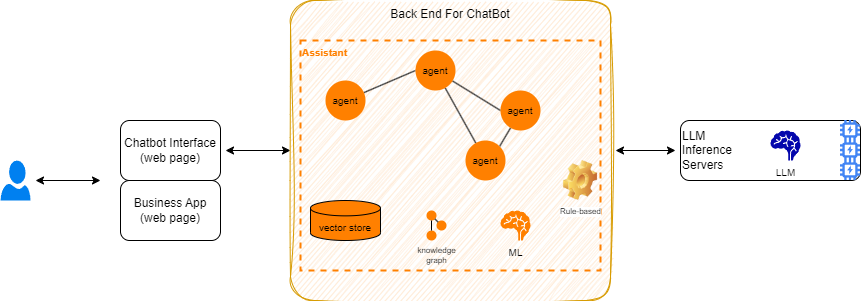

# From Generative AI to Hybrid AI

## Introduction

Generative AI uses special types of neural network models to generate new content (text, image, music, videos..) based on a request that is typically text. Models are pre-trained on vast amounts of unlabeled data, using from 7B to 500B parameters. The models are trained on vast amounts (terabytes) of data like books, articles, websites etc. This helps the model to simulate learning grammar, facts, reasoning abilities and even some level of common sense from the content.

Gen AI's natural language understanding and generation capabilities applies well to different use cases: improve customer experience, improve an employee's productivity, provoking creativity by generatinv ideas, and optimizing certain business processes.

### Key Concepts

Generative AI today is often used via a chatbot hosted by an AI vendor like OpenAI, Anthropic, IBM, or Mistral. Most of the platforms, including IBM's watsonx.ai, use Large Language Models (LLM) with many query types. The architecture of such a system looks like this:

{ width=900 }

The LLMs are hosted on dedicated hardware with GPUs that are needed for high-speed inference.  (Inference is the technical term for generating new content with a model.)  LLMs are primarily used to do natural language processing (NLP) of unstructured queries from human users. The interactions are stateless, and the concept of a context window is used to include contextual data as part of the query.   Contextual data includes previous dialog in a conversation, system prompts, relevant bits of information from other documents (called RAG), or data brought in from databases or external API service calls.  As the LLM is essentially stateless, any information used to generate a response must be included in the context, which is why context window size is very important.   Since most AI companies charge per token consumed and generated, the more context that is included in each LLM query, the more expensive the query.

{ width=900 }

IBM's watsonx.ai, for example, helps users select which LLM to use, define system prompts, and perform queries. As an enhanced platform, AI scientists can also fine-tune an existing open-source model, or develop brand new ML models. 

The same approach exists for vendors like Anthropic, OpenAI, Perplexity, Mistral, Hugging Face, Anakin AI, AWS Bedrock, and so on. 

Models used for inference are accessible via an API.

Enterprise deployments of Generative AI need a high degree integration, since enterprise applications need to leverage enterprise-specific instructions, documents, services, and data to perform useful functions for the company. Some tools are already available to help develop Generative AI workflows: For instance watsonx Orchestrate has a no-code approach for leveraging a library of skills. For developers, lower level frameworks, such as LangChain, LlamaIndex or Haystack, offer Python-based libraries with enormous flexibility and a high degree of complexity. 

So a real deployment looks like in the following figure:

{ width=900 }

The backend for a chatbot application needs to be integrated with existing data sources and services including databases, SOA services, Customer Relationship Management platforms, predictive machine learning models and scoring engines, business process management workflows -- and of course business-rule based decision services... The data from these services need to be included in a conversation with a human user if it is to be relevant to the user's current context.   Fine-tuning the model with the latest information in infeasible when enterprise data changes every second, so a dynamic approach to getting the data into the LLM's context window is needed.   In addition, in order to effect changes in the enterprise environment, the user needs to be able to update data or call services.

All those custom solution can be deployed in virtual private cloud, on-premises servers or in an hybrid cloud.  Other IT considerations such as security are also paramount.

When there is complex integration, there is development effort.   The OwlAgent Framework attempts to minimize the development effort by providing simple abstractions and a declarative way of using different components in a specific application.

### Challenges

LLM's are amazing tools for doing natural language processing.   But they come with challenges due to the underlying training and inference technology, due to the fact they are trained only occasionally and are thus always out of date, and due to the fact that natural language generation is not grounded in any model of reality or reasoning but instead uses probabilistic techniques based on correlations of a huge number of strings of tokens (words).

* **Accuracy**: The accuracy of LLM's is not acceptable to any enterprise that must follow regulations and policies and respect contractual agreements with suppliers and customers.   Because they cannot truly reason or take into account regulations and policies precisely, models often produce incorrect and contradictory answers when asked for decisions or actions to undertake.  With classical ML, probabilistic output is expected. Symbolic approaches like business rules that precisely express policies produce reliable results at the cost of coding the policies mostly manually.

* **Specificity**: A single large model is unlikely to solve every business problem effectively because it is trained on generally-available information rather than enterprise-specific information. To differentiate their generative AI applications and achieve optimal performance, companies should rely on their **own data sets** tailored to their unique use case.   Even then, enterprise data changes constantly, so techniques such as RAG and tool calling are needed to leverage the most up-to-date and relevant information for a specific query.

* **Cost and Risk** of training and inference, as well as privacy and intellectual property are top concerns. LLM's can be "fine-tuned" for a specific task by using a small number of labeled examples specific to the company's industry or use case. Fine-tuned models can deliver more accurate and relevant outputs. But training and retraining models, hosting them, and doing inference with them are expensive. Cloud providers see this opportunity to sell more virtual servers equipped with GPU's at a higher price. 

* **Skills**: developing a new LLM may not make sense today, but fine tuning an existing model may in some circumstances. There are relatively few developers with expertise in model tuning, understanding their architecture and limitations, integrating them in applications, and in tuning their hyper parameters. Reinforcement learning to fine-tune existing LLM requires a huge number of trials, and data quality is still a very difficult and poorly-mastered topic.

* **Reliability and reasoning**: Generative AI models do not reason and plan accurately. New versions of LLMs attempt to improve this, but by design the transformer algorithm is probabilistic and greedy for text generation and does not inherently do any kind of structured symbolic reasoning or manage ontologies of concepts (knowledge graphs). 

The next sections explains the generative AI architecture in more detail.

### Transformer Architecture

**GPT-3 (Generative Pre-trained Transformer 3)** breaks the NLP boundaries with training on 175B parameters. It is built on **Transformer** which uses self-**attention** mechanism to weigh the significance of different words in a sentence to understand the context in a sequence of data. 

To process a text input with a transformer model, the text is **tokenized** into a sequence of words or part of words. These tokens are then **encoded** as numbers and converted into **embeddings**, which are vector-space representations of the tokens that preserve their meaning. Next, the encoder in the transformer, transforms the embeddings of all the tokens into a **context vector**. Using this vector, the transformer decoder generates output based on clues. The decoder can produce the subsequent word. This process can be repeated to create an entire paragraph. This process is called **auto-regressive generation**.

The **attention** mechanism computes the similarity between tokens (the embeddings of words) in a sequence. The process keeps few tokens around each word to help understand the context. This surrounding group of tokens is called the **context window**. It is the sliding group of tokens around a word that provides contextual information. That way, the model builds an intuition of what the text is saying. The closer two words are in a vector space, the higher the attention scores they will obtain and the higher the attention they will give to each other.

The second part of the GPT-3 architecture are the **layers** of transformers stacked on top of each other. Within each layer, there are feed-forward neural networks to process the data.

The training has two stages: **Pre-training** where the model attempts to predict the next word in a sentence using its own corpus, and **fine tuning** where the model can be tuned for specific *tasks* or *content*. During the pre-training process, the model automatically takes context into account from all the training data, and tracks relationships in sequential data, like the words in a sentence, to develop some understanding of the real world.

At **inference** time, the input text is tokenized into individual tokens which are fed into the model. After processing using the transformer mechanism, the model returns result tokens which are then turned back into readable text.

## Use cases

We can group the Generative AI use cases in the following different categories:

???- info "Improve customer experiences"
    * Chatbot functionality with context, with better user's experiences. Reduce operational costs using automated response.
    * Documentation summarization: See model like Jurassic-2 Jumbo from [AI21 studio](https://www.ai21.com/studio), claude-v2 works well too.
    * Personalization

???- info "Improve employee productivity"
    * Code generation
    * Translation, reports, summarization...
    * Search via Q&A Agent for specific subject, based on Corporate document processing. LLM helps understanding the text and the questions. The LLM is enriched, trained on proprietary corpus:

    { width=600}

    * Self service tutor based on student progress, prompt activities, and respond to questions
    * Personalized learning path generation
    * Low-code development with GenAI agents

???- info "Creativity"
    * Auto-generation of marketing material
    * Personalized emails
    * Sales scripts for customer's industry or segment
    * Speeding the ideation phase of a product development

???- info "Business process optimization"
    * Automatically extracting and summarizing data from documents: combine OCR with prompt to extract data and build json doc to be structured for downstream processing: Gen AI based intelligent document processing may looks like this:

    { width=600}

    * Data augmentation to improve data set quality. Keep the privacy of original data sources, and help trains other models: generate image of rusted pumps to train an anomaly detection model on pumps.
    * Propose some supply chain scenario

## Retrieval Augmented Generation (RAG)

LLMs have a knowledge cut-off time, where data coming after are not known by the model.  Pre-training is a one-off exercise. When enterprises need to get their private knowledge integrated to LLM, they can do fine tuning or present semantic search results as part of the input context window. Retrieval Augmented Generation addresses this problem as it is the act of supplementing generative text models with data outside of what it was trained on.

### Basic architecture

The Retrieval Augmented Generation may be seen as a three stages process:

{ width=900 }

1. **Indexing** a batch processing to ingest documents and data from a source and indexing them. During processing semantic search is used to retrieve relevant documents from the index. Indexing supports loading the documents, splitting large documents into smaller chunks. Chunks help to stay within the LLM's context window. Indexing includes storage of the documents and index of the splits.
1. **Retrieval**: retrieves the relevant data (splits) from the index, then passes that to the model as part of the context.
1. **Generation**: generate the response in plain natural language.

This process is supported by tools for documents ingestion, splitting, embedding, indexing, retrieval and integration with the real time conversation flow.

RAG systems work well because LLMs has the in-context learning capability, which allows models to use previously unseen data to perform accurate predictions without weight training.

As LLM increase the context window size over new release, RAG can add more new data to it. 

### Challenges

Naive RAG has very important limitations which has generated some adoption challenges:

* It is hard to do a reliable, scalable RAG on a large knowledge corpus
* Limited to single-shot prompt
* No query understanding, just a sematic search
* No query decomposition for planning
* No tool use, to query an external data source to enrich the context
* No reflection and error correction to improve the quality of the response.
* No persistence or memory of previous queries

## Hybrid-AI

Hybrid AI refers to the integration of different AI approaches or techniques to create more robust and capable AI systems. The classical hybrid AI is to combine traditional, rule-based **symbolic AI** systems with deep learning models. The rule-based engine can handle logical reasoning and knowledge representation, while the deep learning component handles pattern recognition and unstructured data processing.

Another architecture for hybrid AI is the emergence if multi-agent systems, by combining multiple specialized AI agents, each with their own capabilities and decision-making processes, to tackle complex problems that require diverse skills and perspectives. Those agents can be chained or deployed for parallel processing. Agents are stateful.

If we want to present, at the high level what an hybrid AI is, we can highlight the following components:

{ width=900 }

The backend for chatbot includes assistants that organize workflow if agents, that serve LLM, classical machine learning predictive scoring models, knowledge graph, rule-based engine and vector store for similarity searches. Those agent workflows are stateful. 

### The key benefits

Hybrid systems can achieve better overall accuracy performance than any single generic LLM, they are more resilient to the weaknesses or limitations of LLMs. The adoption of knowledge graph and rule-based system make the AI architecture more flexible 
to support a wider range of problems and scenarios. 

For compliance and regulations, symbolic AI results are more interpretable and explainable than neural network decisions.
