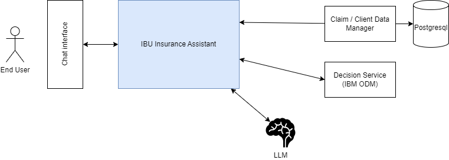

# IBU Insurance

The IBU insurance demonstration illustrates the integration with data manager service and a decision service, a vector store and a LLM.



## Build for demonstration

For development purpose build the DataManager microservice images:

```sh
cd datamgt
./build/buildImage.sh
```

This docker image is available on docker hub.

## Run locally

To start all the components of the solution like the owl_backend, the data manager, postgresql, and ODM decision service, use the docker compose file locally under the `IBU-insurance-demo/deployment/local/` folder. 

```sh
docker-compose up -d 
```

The first time you launch it, it may takes some time as it downloads the needed docker images.

Verify that the five containers are running:

```sh
docker ps
```

```
2ecb23b78ad5   jbcodeforce/ibu-insurance-data-mgr:latest  0.0.0.0:8080->8080/tcp, 8443/tcp         datamgr
3988ffd617c6   jbcodeforce/athena-owl-backend:latest      0.0.0.0:8000->8000/tcp                   owl-backend
349f3beb4174   icr.io/cpopen/odm-k8s/odm:8.12             0.0.0.0:9060->9060/tcp, 9080/tcp, 0.0.0.0:9443->9443/tcp, 9453/tcp   decisionsvc
070e124923f7   postgres:latest                            0.0.0.0:5432->5432/tcp                   postgres
86052092cfe7   ghcr.io/chroma-core/chroma:latest          0.0.0.0:8005->8000/tcp                   chroma-db
```

To look at owl-backend logs

```sh
docker logs owl-backend
```

Next see the demonstration script section, or the non-regression tests to automate the validation.

## Non-regression tests

Under the `e2e` folder you can find different tool to support automatic testing

```
python non_regression_tests.py
```

## Demonstration Script


## Component Definitions

### Define Assistant


### Define Agent

### Define Tools

### Define prompt

### Integration tests

