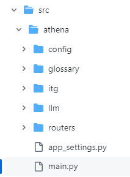
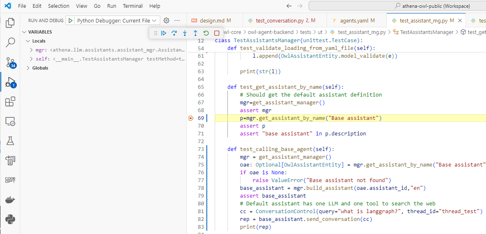

# Setting up your development environment

This section describe how to use the Owl Agent Framework to start developing new assistant and work on the core components or demos we are providing.

## One time setup

If you want to contribute to the Core Framework, you need to fork the current  [https://github.com/AthenaDecisionSystems/athena-owl-core](https://github.com/AthenaDecisionSystems/athena-owl-core) repository to your own account and then clone your repository.


If you do not want to participate, you can close the core repository to access some of the scripts and base code:

* Clone the core framework code and tools

```sh
git clone https://github.com/AthenaDecisionSystems/athena-owl-core
# or your forked repo
git clone https://github.com/<GIT_USER>/athena-owl-core
```

* [Optional] clone the demonstration repository: [https://github.com/AthenaDecisionSystems/athena-owl-demos](https://github.com/AthenaDecisionSystems/athena-owl-demos).

```sh
git clone https://github.com/AthenaDecisionSystems/athena-owl-demos
```

*Again, if you want to contribute to the demonstration repository, you should first fork it and then clone your forked repo*.

* You need Python 3.11 or 3.12
* Create (one time) and Start (each time you want to start working on the code) a Python virtual environment:

```sh
python -m venv .venv
# For windows PC
source .venv/Scripts/activate
# For unix based PC
source .venv/bin/activate
```

* Within the Python virtual environment, install the Python module for core backend:

```sh
cd owl-agent-backend
# under the folder owl-agent-backend
pip install -r src/requirements.txt
```

And for the testing 

```sh
# under the folder owl-agent-backend
pip install -r tests/requirements.txt
```

* Create a .env file for accessing remote LLM, and update any of the API KEY. You need at least Mistral and OpenAI keys

```sh
# under the folder owl-agent-backend
cp ../tools/.env_tmpl .env
```

## Validating Unit Tests for the Backend

To verify your environment is running file for the core components, run all unit tests

```py
pytest -s tests/ut/
```

Most of the tests are done using [Python unittest](https://docs.python.org/3/library/unittest.html) and [pytest](https://docs.pytest.org/en/8.2.x/)

## Understand the Core Framework code organization

The following figure presents the backend code organization:



| Folder | Functions |
| --- | --- |
| **routers** | Includes the different REST resources: conversation, assistant, agent, tool, prompt and document |
| **config** | Configuration file when the application runs in container. The configuration files are mounted inside the container under /app |
| **itg** | This is for the integration, so most of the code there is mockup placeholder for demonstration, the only important component is the store to keep data about the files uploaded in the context of RAG |
| **llm** | The different repository to manage each OwlEntities like, assistant, agent, tools, prompts...There are also some pre-defined assistants and agents that could be used for integrating in solution |

The config folder and llm folder are the one you may add code and configuration into. For specific end-to-end demo we recommend using a separate repository and the start your own solution tool.


## Running locally

### Pre-requisites

* Prepare your .env file, using your personal Keys

```yaml
OPENAI_API_KEY=---your-key---
WATSONX_APIKEY=---your-key---
MISTRAL_API_KEY=---your-key---
LANGCHAIN_API_KEY=---your-key---
LANGCHAIN_TRACING_V2=true
LANGCHAIN_ENDPOINT=https://api.smith.langchain.com
...
```

* Create and start virtual python env (once created just activate it). Test with python 3.12.3. Above that there is some incompatibility with langchain modules (as of 6/15/2024).

```sh
python -m venv .venv
# for MAC / Linux users
source ./venv/bin/activate
# for Windows
source ./venv/Scripts/activate
```

* Install the needed python modules with `pip install -r src/requirements.txt` and `pip install -r tests/requirements.txt`
* build the owl backend image under the `owl-agent-backend` folder.

```sh
./build/buildImage.sh
```

This image can be pushed to docker hub. (as of now it is the `jbcodeforce/athena-owl-backend:latest` image)


* Build the owl-frontend docker image under the `owl-agent-frontend` folder:

```sh
./build/buildImage.sh
```


### Development mode

While developing the backend, the approach is to use test-driven development and start by writing unit tests for any new or changed feature. Each unit test python file defines a `unittest.TestCase` class and a test method. For each entity manager, instantiate a manager and then do some testing of the api.

For conversations, use the ConversationControl object.

```python
def test_base_assistant_with_chat_history(self):    
    cc = ConversationControl()
    cc.assistant_id="base_assistant"
    cc.user_id="unit_test"
    cc.thread_id="1"
    cc.chat_history=[]
    cc.query="Hi, I'm Bob and my last name is TheBuilder."
    rep = get_or_start_conversation(cc)
    assert rep
    assert rep.message
```

It is also possible to start a uvicorn server with continuous upload of the code and then test using the OpenAI exposed.

1. Start the server under the `src` folder with `./start_backend.sh`. It uses a special config file (named [local-config.yaml](https://github.com/AthenaDecisionSystems/athena-owl-core/blob/main/owl-agent-backend/src/local-config.yaml)) to access the other entities configurations.
1. Use the [localhost:8000/docs](http://localhost:8000/docs) URL
1. Use any of the entity APIs
1. Use the generic/chat URL to send the conversation.

The minimum payload to use one of the assistant is the following:

```json
{
  "query": "What is Athena Decision Systems all about?",
  "user_id": "jerome",
  "assistant_id": "fake_assistant",
  "thread_id": "1"
}
```

### Run unit tests

Running all the tests for non-regression validation:

```sh
pytest -s tests/ut/
```

To debug unit tests in VSCode:

* As the src code and tests are in separate folders, be sure to have configured the debugger launch settings as:

```json
{
    "version": "0.2.0",
    "configurations": [
        
        {
            "name": "Python Debugger: Current File",
            "type": "debugpy",
            "request": "launch",
            "program": "${file}",
            "console": "integratedTerminal",
            "env": { "PYTHONPATH": "${workspaceRoot}/owl-agent-backend/src"},
            "cwd": "${workspaceRoot}/owl-agent-backend"
        }
    ]
}
```

Then breakpoint and step by step.



### Integration mode

There are two ways to do integration tests, with docker or with the start_backend.sh script.


## Next

* [Implementing your own agent tutorial](new_mistral_agent.md)