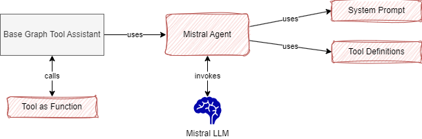

# Developing a new agent based on Mistral

In this tutorial, you will learn how to develop a new agent for the Mistral API and integrate it into an existing Assistant. The current end game code is under `llm/agents/mistral_agent.py` and config file.

The following diagram illustrates what is built:



## Pre-requisites

You need to get the MISTRAL_API_KEY from [mistral.ai](https://mistral.ai). Be sure to be familiar with their API [using their getting started guide.](https://docs.mistral.ai/getting-started/quickstart/)

Update the `.env` file in the backend with the MISTRAL_API_KEY environment variable.

You have set up your development environment [according to this note](./dev_env.md)

## Defining the agent

An agent is at the minimum the LLM API client code, a model reference and parameters, and the way to manage the conversation. A new agent has a contract with the Owl Framework via the OwlAgent class. Therefore the first step is to create an agent python file named: `mistral_agent.py` and define a class that supports the contract of the constructor as shown below:

```py
from athena.llm.agents.agent_mgr import OwlAgentInterface,

class MistralAgent(OwlAgentInterface):
    
    def __init__(self,agentEntity: OwlAgentEntity, prompt: BasePromptTemplate, tool_instances: Optional[list[Any]]):
        self.prompt = prompt
        self.model=self._instantiate_model(agentEntity.modelName, agentEntity.modelClassName, agentEntity.temperature)
```

Let start by unit testing this class: under the `tests/ut` folder add a python file: `test_mistral_agent.py` by copying the unit test template:

```sh
# under tests/ut
cp template_ut.py test_mistral_agent.py
```

Rename the class and add a first test:

```py
from athena.llm.agents.agent_mgr import get_agent_manager, OwlAgentEntity

class TestMistral(unittest.TestCase):

    def test_define_agent_entity_create_instance(self):
        """
        From the OwlAgentEntity verify the factory can create the agent executor
        """
        print("\n\n >>> test_define_agent_entity_create_instance\n")
        agent_entity = OwlAgentEntity(agent_id="mistral_large",
                                      modelName="mistral-large-latest",
                                      modelClassName="langchain_mistralai.chat_models.ChatMistralAI",
                                      temperature=0,
                                      )
        assert agent_entity

```

Running this test with `pytest -s tests/ut/test_mistral_agent.py` may fail as the `langchain-mistralai` is missing in the `src/requirements.txt`